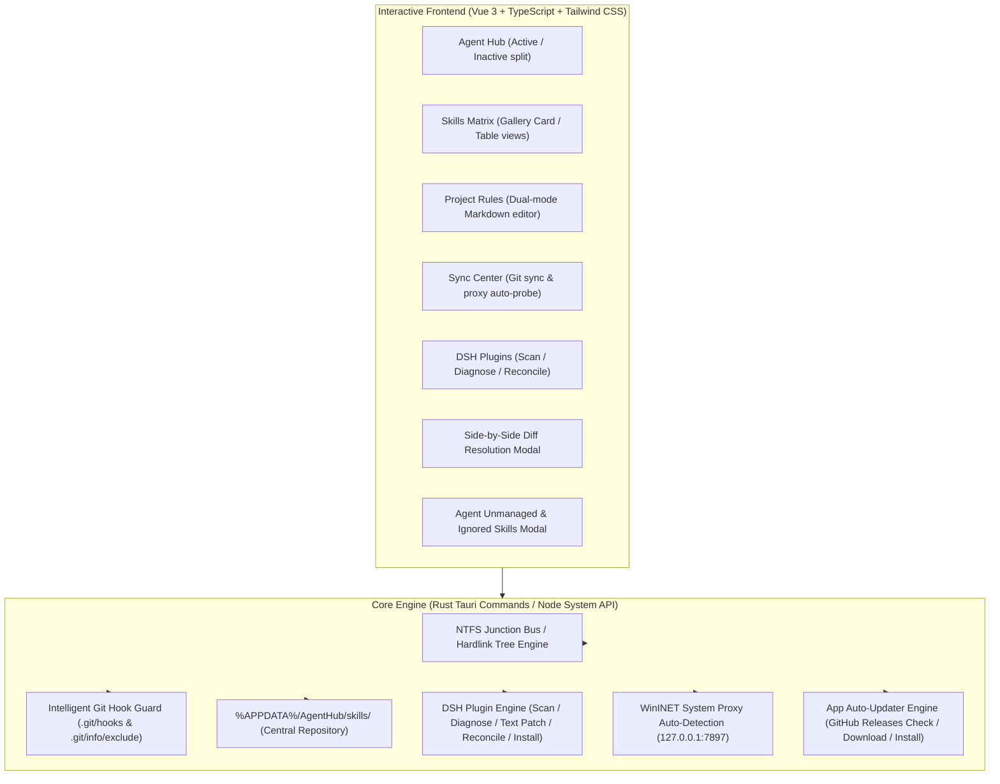
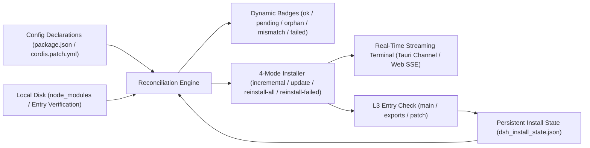

# AgentHub (AGENT_CONFIG_MANAGE)

<p align="center">
  <strong>Unified Cross-Agent AI Configuration Hub · Central Skills NTFS Junction Matrix · Zero-Git-Conflict Project Rules Engine · Full DSH Plugin Lifecycle Management · Online Auto-Updater</strong>
</p>

<p align="center">
  <a href="README.md">简体中文</a> |
  <a href="README.en.md">English</a>
</p>

<p align="center">
  <a href="https://github.com/Nomit8088/AGENT_CONFIG_MANAGE/releases"></a>
  
  
  
  
  
</p>

---

## 📖 Overview

In modern AI-assisted software engineering, developers commonly combine multiple AI Coding Agents (**Claude Code, Google Antigravity, Cursor, Windsurf, OpenCode/Codex, ZCode, DeepSeek HARNESS (DSH), Trae, GitHub Copilot**, etc.). However, local development environments face severe fragmentation:
- **Team Git Rule Conflicts**: Shared repositories track global `AGENTS.md` / `CLAUDE.md`. Modifying them locally causes persistent merge conflicts when switching branches or running `git pull`;
- **Fragmented Skills & Commands**: Each agent uses distinct skill directories (`~/.claude/skills`, `~/.gemini/config/skills`, `~/.codex/skills`, `~/.dsh/skills`, etc.), making skills written in one agent inaccessible to others without manual copy-pasting;
- **Silent Directory Junction Failures**: Google Antigravity on Windows silently skips NTFS Directory Junctions (`FILE_ATTRIBUTE_REPARSE_POINT`) due to sandbox isolation policies;
- **Unmanaged DSH Plugin Lifecycle**: DeepSeek HARNESS (DSH) plugins are scattered across `package.json` and `cordis.patch.yml`, making `dsh web` startup crash troubleshooting difficult and multi-device config sync prone to version drift.

**AgentHub** is a high-aesthetics, lightweight, instant-response desktop configuration station. Built on **Tauri 2.0 (Rust) + Vue 3 / TypeScript**, AgentHub features a **Dual-Mode execution architecture** (Tauri Desktop & Web Browser dev mode) powered by **Windows NTFS Junction / Symlinks**, a **file-level Hardlink Tree two-way sync engine**, **intelligent Git Hook guards**, a **DSH Plugin Manager**, and an **app auto-updater**. It delivers instant cross-agent rule switching, single-source-of-truth skill distribution, zero Git conflict repository isolation, and GitHub Releases check / download / one-click install.

---

## 🎯 Pain Points & Innovative Solutions

| Pain Point | Traditional Method & Limitations | AgentHub Solution |
|---|---|---|
| **Team Git Conflicts & Pollution** | Team repos track public `AGENTS.md` / `CLAUDE.md`. Editing them locally breaks branch switches and pulls; relying on system prompt reminders wastes tokens and risks accidental commits polluting team baselines. | **Zero Git Conflict Dual Modes**:<br>🔹 **Append Mode**: 100% preserves original baseline files untouched; dispatches private rules to agent-specific local files (`CLAUDE.local.md`, `AGENTS.local.md`, `.agents/rules/`, etc.) and automatically adds them to `.git/info/exclude` (zero conflicts, Hook-free).<br>🔹 **Overwrite Mode**: Backs up original files, injects `pre-checkout` & `post-checkout` hooks for branch-switch restoration, and installs `pre-commit` guards to block accidental personal rule commits (with bypass toggle). |
| **Skills / Commands Ecosystem Fragmentation** | Skills directories differ across agents. Sharing requires repetitive manual file copying, leading to version drift and high maintenance overhead. | **Central Skills Single Source of Truth**:<br>Unified storage at `%APPDATA%\AgentHub\skills\`. Dispatch to any agent instantly via Tag Pills & Teleported multi-agent pickers with NTFS Junction / Hardlink trees. |
| **Sandbox Directory Link Failure** | Google Antigravity on Windows silently skips directory junctions (`FILE_ATTRIBUTE_REPARSE_POINT`) due to sandbox loop prevention. | **File-Level Hardlink Tree Engine**:<br>Creates a physical directory for Antigravity containing file-level NTFS Hardlinks (`mklink /H`) sharing MFT Inodes — 0 disk overhead, 0 latency, 100% native detection, and 2-way real-time sync. |
| **Unmanaged Local Standalone Skills** | Dispersed physical skill folders from past manual creation or npx installs lack central visibility and conflict management. | **Unmanaged Detection & Side-by-Side Diff Modal**:<br>Automatically discovers untracked physical folders, supports one-click adoption, private ignore lists (`ignored_skills`), and side-by-side Diff resolution (Overwrite/Rename/Skip). |
| **Multi-Device Sync & Network Proxy** | Synchronizing skills across machines is tricky, and direct connections to GitHub in restricted networks often trigger connection resets. | **Sync Center & Auto Proxy Detection**:<br>Syncs `skills/` and `dsh/` mirrors with `%APPDATA%\AgentHub` as Git root. Automatically detects Windows WinINET system proxy (`127.0.0.1:7897`), injects Git proxy configs, and provides fast-forward safe pulling. |
| **DSH Plugin Management Difficulties** | DSH plugins are split between `package.json` and `cordis.patch.yml`. Debugging startup crash logs is tedious and manual patch editing is error-prone. | **DSH Plugin Manager**:<br>Visual plugin scanner (Bundle / Plain Dep / Patch row / portability tags), automatic stderr crash diagnosis & one-click recovery, safe text-level patch mutations, 3-way install-state reconciliation + 4-mode installer + per-package update check, and Git config sync & reconciliation. |

---

## 🌐 16 AI Agents Master Matrix

AgentHub natively supports 16 mainstream AI Agents with official high-precision vector SVG brand icons, private rule file configurations, and automatic filesystem detection:

| Agent ID | Official Name | Skills Directory (`skillsDir`) | Native Rule Files | Reads Root `AGENTS.md`? | Recommended Override File (`localRuleFilename`) | Official Brand Color & Icon |
|---|---|---|---|:---:|---|---|
| `claude-code` | **Claude Code** | `~/.claude/skills` | `CLAUDE.md` | ❌ | `CLAUDE.local.md` | Anthropic Coral 14-spoke Sunburst (`#D97757`) |
| `cursor` | **Cursor** | `~/.cursor/skills` | `.cursorrules`, `.cursor/rules/*.mdc` | ❌ | `.cursor/rules/local-override.mdc` | 3D Isometric Cube & Arrow (`#38BDF8`) |
| `windsurf` | **Windsurf** | `~/.windsurf/skills` | `.windsurfrules`, `WINDSURF.local.md` | ❌ | `WINDSURF.local.md` | Codeium Teal Ocean Wave (`#0D9488`) |
| `antigravity` | **Google Antigravity** | `~/.gemini/config/skills` | `GEMINI.md`, `.agents/rules/*.md`, `AGENTS.md` | ✅ | `.agents/rules/local-override.md` | Google AI 4-Point Gradient Star (`#4E82EE` → `#10B981`) |
| `codex` | **OpenCode / Codex** | `~/.codex/skills` | `AGENTS.md`, `AGENTS.override.md` | ✅ | `AGENTS.override.md` | OpenAI Ribbon Swirl Vortex (`#10A37F`) |
| `zcode` | **ZCode** | `~/.zcode/skills` | `ZCODE.local.md`, `AGENTS.md` | ✅ | `ZCODE.local.md` | Matrix High-Tech Indigo (`#818CF8`) |
| `dsh` | **DeepSeek HARNESS** | `~/.dsh/skills` | `AGENTS.md`, `CLAUDE.md` | ✅ | `AGENTS.local.md` | DeepSeek Official Whale (`#4D6BFE`) |
| `mimocode` | **MiMo Code** | `~/.config/mimocode/skills` | `AGENTS.md`, `CLAUDE.md`, `mimocode.json` | ✅ | `AGENTS.md` | Xiaomi Intelligence Orange (`#FF6900`) |
| `openclaw` | **OpenClaw** | `~/.openclaw/skills` | `AGENTS.md`, `SOUL.md`, `IDENTITY.md` | ✅ | `AGENTS.md` | Cybernetic Claw Badge (`#F97316`) |
| `hermes` | **Hermes Agent** | `~/.hermes/skills` | `.hermes.md`, `AGENTS.override.md`, `AGENTS.md` | ✅ | `AGENTS.override.md` | Nous Research Winged Helm (`#F59E0B`) |
| `copilot` | **GitHub Copilot** | `~/.copilot/skills` | `.github/copilot-instructions.md`, `AGENTS.md` | ✅ (Coding Agent) | `.github/copilot-instructions.md` | GitHub Purple Pilot Robot (`#8957E5`) |
| `pi` | **Pi Coding Agent** | `~/.pi/skills` | `.omo/rules/`, `AGENTS.md`, `CLAUDE.md` | ✅ (requires pi-rules) | `.omo/rules/local.md` | Inflection Green Pi Symbol (`#22C55E`) |
| `kimi` | **Kimi Code CLI** | `~/.kimi/skills` | `AGENTS.md` (root+sub), `~/.kimi/AGENTS.md` | ✅ | `AGENTS.md` | Moonshot Indigo Star Burst (`#6366F1`) |
| `trae` | **Trae / TraeWork** | `~/.trae/skills` | `.trae/rules/`, `AGENTS.md`, `CLAUDE.local.md` | ✅ (optional config) | `CLAUDE.local.md` | ByteDance Prism Cyan (`#00E5FF`) |
| `workbuddy` | **WorkBuddy** | `~/.workbuddy/skills` | `AGENTS.md`, Codex instructions | ❓ (config-dependent) | `AGENTS.md` | Collaboration Robot Blue (`#3B82F6`) |
| `kiro` | **Kiro CLI** | `~/.kiro/skills` | `~/.kiro/agents/*`, `AGENTS.md`, `AmazonQ.md` | ✅ | `AGENTS.md` | Amazon Q Magenta Gradient (`#E056FD`) |

> **💡 DSH Multi-Root Skills Support**:  
> DSH's `skill-filesystem` scans user-level `~/.dsh/skills` and `~/.agents/skills` by default. AgentHub mounts DSH skills into `~/.dsh/skills` and coordinates cleanup across all user skill roots on enable/disable/delete/takeover, ensuring immediate 100% state reflection.

---

## 🏗️ Architecture & Core Modules



### 1. Agent Hub
- **Dual Status Split**: Separate sections for active vs. inactive agents, with search filtering and one-click batch activation;
- **Auto-Discovery**: Detects 16 agent runtimes on startup, verifying config paths and private rule support.

### 2. Skills Matrix
- **Tag Pills & Teleported Multi-Agent Picker**: Instant toggle for mounting/unmounting skills to target agents;
- **Full Search & Dual Views**: Fuzzy search by name, description, tags, slash commands; filters by source and mounting status; switch between Card Gallery and Table view with persistent preference;
- **Kernel File Watcher**: Background `notify` thread tracks real-time filesystem changes.

### 3. Project Rules Center
- **Multi-Baseline Management**: Manages `AGENTS.md`, `CLAUDE.md`, `.cursorrules`, `.windsurfrules`, etc.;
- **Append Mode**: Keeps baseline untouched, writes private rules to agent-specific files, and adds to `.git/info/exclude` (no hooks needed);
- **Overwrite Mode**: Replaces baseline with custom rules, clears private files to prevent duplicate injection, installs `pre-checkout` & `post-checkout` hooks for branch safety, and installs `pre-commit` guard with UI bypass slider and one-click hook repair.

### 4. Unmanaged Skills Scanner & Diff Modal
- **Cross-Agent Scanner**: Discovers standalone physical folders in agent directories;
- **Side-by-Side Diff Modal**: Highlights differences between local and central versions with Overwrite, Rename, or Skip actions;
- **Private Ignore List**: Mark specific skills as ignored (`ignored_skills`) to suppress prompts.

### 5. Sync Center & Proxy Auto-Detection
- **Global Repo Config + Validation Gate**: Remote URL and branch are maintained in Global Settings → Sync Repo; saving requires connectivity / initialization / format validation (root must contain `skills/` and `dsh/`), and the Sync Center cannot be opened without a configured repo;
- **Central Git Sync**: Uses `%APPDATA%\AgentHub` as Git root to synchronize `skills/` and `dsh/` configurations with remote repositories (GitHub/Gitee/GitLab);
- **Separate Skills / DSH Plugin Management**: The Sync Center is split into per-function sections, each with its own pull, push, and auto-pull toggle; pushes are path-scoped (skills commits only `skills/`, DSH plugins commit only `dsh/`) so neither function sweeps in the other's changes;
- **WinINET Proxy Detection**: Automatically detects proxy settings (`127.0.0.1:7897`) and injects `-c http.proxy / -c https.proxy` into Git operations;
- **Safe Pulling**: Fast-forward only pulls with connection pre-checks to protect local work.

### 6. DSH Plugin Manager
- **Visual Scanner**: Inspects `~/.dsh/profiles/*` for bundles (`@deepseek-ai/dsh-*`), user bundles, dependencies, and patch rows with portability warnings; supports source/status grouping, health-capsule filters, and list / card dual views with pagination;
- **Crash Diagnosis & Auto-Recovery**: Captures `dsh web` stderr on startup (15s timeout with process tree termination), parses failed plugins, suggests recovery actions, and detects `EADDRINUSE` port conflicts;
- **Install-State Reconciliation & 4-Mode Installer**: Items = config declarations ∪ local `node_modules` ∪ persistent install state, with five status badges (`ok` / `pending` / `orphan` / `version-mismatch` / `failed`); supports incremental / update / reinstall-all / reinstall-failed modes, L3 per-package entry verification, and persistent failure stacks; orphan packages can be adopted or removed;
- **Per-Package Update Check**: Runs `git ls-remote` against `git+https` / `github:` specs and one-click `pnpm update <pkg>`;
- **Streaming Install Terminal**: Real-time install logs via Tauri `Channel<String>` / Web SSE;
- **Sync & Reconcile**: Mirrors `package.json` + `cordis.patch.yml` + `pnpm-lock.yaml` into the Git sync repo and aligns them with one-click `pnpm install`;
- **Safe Text-Level Patch Engine**: Pure text-level patch modifications preserving comments and `!!js` tags without destructive full `yaml.dump`.

---

## ⚡ DSH Plugin Panel V2: Install-State Reconciliation & Full-Featured Installer

> 📌 **Implemented**, architecture plan: [**PLAN_DSH_PLUGIN_PANEL_V2.md**](PLAN_DSH_PLUGIN_PANEL_V2.md)

The DSH plugin panel has been upgraded from a read-only configuration view into a **3-Way Reconciliation View ("Config ↔ Local Disk ↔ Installation Result") & Full-Featured Installer**:



| Feature Module | Key Technical Highlights |
|---|---|
| **P1. Full State Reconciliation** | 🔹 **3-Way Merged Items**: Config declarations ∪ `node_modules` ∪ Persistent State;<br>🔹 **5 Status Badges**: `ok`, `pending`, `orphan`, `version-mismatch`, `failed`;<br>🔹 **Exemption Rules**: Built-in packages `@deepseek-ai/dsh-*` (`kind=inbox`) always `ok`; non-semver specs (`git+`, tarball URLs) exempt from version mismatch; `pnpm-lock.yaml` scans `packages:` block only; stale `failed` entries auto-heal on disk health. |
| **P2. 4-Mode Installer** | 🔹 **Incremental (`incremental`)**: Runs `pnpm install` for missing/changed dependencies (safe default);<br>🔹 **Update (`update`)**: Runs `pnpm update` within spec constraints;<br>🔹 **Reinstall All (`reinstall-all`)**: Runs `pnpm install --force` (with confirmation dialog);<br>🔹 **Reinstall Failed (`reinstall-failed`)**: Targeted forced reinstall of failed packages. |
| **P3. Persistent State & L3 Entry Check** | 🔹 **L3 Verification**: Validates `main`, `exports`, and `dsh.bundle.patch` entries in `node_modules/<pkg>/package.json` to catch zero-exit source code packages;<br>🔹 **Failure Persistence**: Stores failure stack traces in `%APPDATA%\AgentHub\dsh_install_state.json` (in `.gitignore`), with UI modal inspection. |
| **P4. Streaming Terminal** | 🔹 **Dual Streaming Pipeline**: Tauri desktop uses `Channel<String>`, Web browser mode uses Server-Sent Events (SSE);<br>🔹 **`DshInstallTerminal.vue`**: macOS Vibrancy dark surface, monospace streaming logs, and auto-scrolling. |

---

## ⚡ App Auto-Updater (cc-switch Style)

AgentHub ships with **cc-switch style** GitHub Releases self-updating (no Tauri Updater signing chain required):

- **Check for Updates**: Queries the GitHub Releases API (`releases/latest`) for the latest tag / release notes / installer assets, then compares versions semantically and shows "Update available";
- **Download Installer**: Prefers the Windows NSIS `.exe` (falls back to `.msi`), streams the download with a live progress bar, and auto-injects the system proxy (reusing WinINET proxy detection);
- **One-Click Install**: Launches the installer after download (NSIS `/S` silent / MSI `msiexec /qn`) and exits the app to complete the overwrite install;
- **Startup Auto-Check**: Optional "check for updates on startup" in global settings; the version badge shows an amber dot when an update is available;
- **Dual-End Alignment**: Tauri desktop `app_update.rs` (`ureq` + `Channel` progress) and Web mode `appUpdate.ts` (HTTPS CONNECT proxy tunnel + SSE) behave identically.

---

## 🎨 UI & Interaction Design Guidelines

AgentHub strictly follows [**DESIGN_GUIDELINES.md**](file:///d:/dev/toolPrograms/agent_config_manager/DESIGN_GUIDELINES.md) — **macOS Vibrancy Minimalist Aesthetics**:

- **3-Tier Dark Gray Hierarchy**:
  - Deep Canvas: `#1c1c1e`
  - Mid-Layer Cards: `#2c2c2e`
  - Action Surface: `#3a3a3c`
  - Vibrancy Layer: `backdrop-blur-xl` with `bg-[#1c1c1e]/80` or `bg-[#1c1c1e]/95`
- **Dual-Theme Support**: Light mode with pure white/slate surfaces (`#f5f5f7` / `#ffffff` / `text-slate-900`) maintaining high contrast and subtle shadows;
- **Typography**: Headings use **Serif typography (`font-serif`)**, body text uses system sans-serif, and paths/codes use **monospace (`font-mono`)**;
- **1px Hairline Borders**: Global `border-white/8` ~ `border-white/12` (`border-black/8` for light mode), strictly avoiding thick 2px/4px borders;
- **macOS Segmented Sliders**: All toggles use segmented sliders: `[ Enabled / On | Disabled / Off ]`;
- **Motion Standards**: Smooth transitions with `transition-colors duration-200 ease-out`, avoiding hover displacement, bounce, or oversized `rounded-3xl` corners.

---

## 💾 Local Storage Specifications

AgentHub data is stored independently from user project repositories:

- **Windows**: `%APPDATA%\AgentHub\` (`C:\Users\<username>\AppData\Roaming\AgentHub\`)
- **Linux / macOS**: `~/.config/agenthub/`

```text
%APPDATA%\AgentHub\
├── config.json               # Global configuration (theme, default mode, sync configs)
├── agents.json               # Registered agents & path rules
├── projects.json             # Managed projects & custom rule states
├── dsh_install_state.json    # DSH plugin installation state & failure logs (in .gitignore)
├── skills\                   # Central skills repository (Single Source of Truth)
│   ├── obsidian-sync\
│   │   └── SKILL.md
│   ├── archify\
│   │   └── SKILL.md
│   └── agenthub-sync\
│       └── SKILL.md
├── dsh\                      # DSH plugin config mirrors (shared Git root with skills)
│   └── profiles\<name>\
│       ├── package.json     # Sanitized package configuration
│       ├── cordis.patch.yml # Text-level patch mirror
│       └── pnpm-lock.yaml   # Dependency lockfile
├── updates\                  # Downloaded installer temp directory for online updates
└── backups\                  # Project baseline safety backups
    └── <project-id>\
        ├── AGENTS.md.orig
        └── CUSTOM_AGENTS.md
```

---

## 🚀 Quick Start

### 1. Clone & Install Dependencies

```bash
# Clone the repository
git clone https://github.com/Nomit8088/AGENT_CONFIG_MANAGE.git
cd AGENT_CONFIG_MANAGE

# Install dependencies
npm install
```

### 2. Web Development Mode (Recommended)

AgentHub provides a **Dual-Mode architecture**. In Web mode, Vite's Node API plugin (`src/server/localApi.ts`) operates on real Windows NTFS Junctions, Hardlinks, and Git Hooks:

```bash
npm run dev
```
Open `http://localhost:1420` in your browser.

### 3. Tauri Desktop Mode

> 💡 Note: Building the Tauri desktop app requires the [Rust toolchain and Cargo](https://www.rust-lang.org/).

```bash
# Run Tauri desktop in dev mode
npm run tauri dev

# Build standalone Windows executable installer (.exe / .msi)
npm run tauri build
```

---

## 🗂️ Project File Structure

```text
├── builtin-skills/                   # Builtin skill templates
│   └── agenthub-sync/SKILL.md        # Reverse sync skill (/agenthub-sync)
│
├── src/                              # Frontend source (Vue 3 + TS + Tailwind)
│   ├── types/index.ts                # TypeScript data interfaces
│   ├── stores/useAppStore.ts         # Pinia reactive state machine
│   ├── services/api.ts               # Dual-Mode IPC adapter (Tauri ↔ Web API)
│   ├── server/
│   │   ├── localApi.ts               # Web mode Node OS layer (NTFS/Hardlink/Git)
│   │   ├── dshPlugins.ts             # DSH plugin scanner / diagnostics / patch / sync / install
│   │   ├── gitSyncUtil.ts            # Git sync & WinINET proxy auto-detection
│   │   ├── syncRepo.ts               # Global sync repo config (validate / save / unbind)
│   │   └── appUpdate.ts              # App auto-updater (GitHub Releases check / download / install)
│   ├── assets/style.css              # macOS Vibrancy styling & custom scrollbars
│   └── components/
│       ├── Header.vue                # Top header bar (stats, rescan, theme switch)
│       ├── Navigation.vue            # Navigation tab bar (Agent/Skills/Projects/Sync/Plugins)
│       ├── AgentBrandIcon.vue        # 16 Agent vector SVG brand icons
│       ├── AgentCard.vue             # Agent status card (Active / Inactive)
│       ├── AgentsView.vue            # Agent Hub view
│       ├── AddAgentModal.vue         # Custom Agent registration modal
│       ├── SkillsMatrix.vue          # Skills Matrix (Search / Filter / Card / Table)
│       ├── SyncView.vue              # Sync Center (skills + DSH plugins, shared repo with per-function sync/pull/push)
│       ├── UnmanagedGroupSection.vue # Unmanaged skills card section
│       ├── AgentDetailModal.vue      # Unmanaged & ignored skills modal
│       ├── AgentPillPicker.vue       # Teleported smart multi-agent picker
│       ├── SkillDrawer.vue           # Skill Markdown detail drawer
│       ├── SkillEditorModal.vue      # SKILL.md editor & creator modal
│       ├── ProjectsView.vue          # Managed projects view
│       ├── AddProjectModal.vue       # Add managed project modal
│       ├── ProjectEditor.vue         # Dual-column rule editor (Append/Overwrite + Hook repair)
│       ├── DiffModal.vue             # Syntax-highlighted Diff conflict modal
│       ├── PluginsView.vue           # DSH Plugin Center container
│       ├── DshPluginList.vue         # DSH local plugin scanner panel
│       ├── DshPluginRow.vue          # DSH plugin unified row (list / card dual layouts)
│       ├── DshInstallTerminal.vue    # DSH streaming install terminal
│       ├── DshDiagnose.vue           # DSH crash diagnosis & recovery panel
│       ├── DshPluginSync.vue         # DSH plugin sync & reconciliation panel (embedded in Sync Center)
│       ├── DshPluginDiffModal.vue    # DSH plugin diff inspection modal
│       ├── SettingsModal.vue         # Preferences modal (theme + auto check update)
│       ├── UpdateModal.vue           # App update modal (check / download progress / install restart)
│       └── ToastContainer.vue        # Floating toast notification container
│
└── src-tauri/                        # Tauri 2.0 Rust backend
    ├── Cargo.toml                    # Rust dependencies (tauri, notify, serde, windows-sys)
    ├── tauri.conf.json               # Tauri window & security config
    └── src/
        ├── main.rs                   # Executable entrypoint
        ├── lib.rs                    # Tauri Command handlers
        ├── models.rs                 # Rust data structures
        ├── fs_junction.rs            # Windows NTFS Junction & Hardlink Tree engine
        ├── git_guard.rs              # Git Hook injector, pre-commit interceptor & multi-baseline restoration
        ├── skills_sync.rs            # Central skills library Git sync
        ├── git_sync.rs               # WinINET proxy auto-detection & Git arg injection
        ├── sync_repo.rs              # Global sync repo config validation & saving
        ├── dsh_plugins.rs            # DSH plugin scan / diagnose / text patch / install / uninstall
        ├── dsh_plugins_sync.rs       # DSH plugin sync / mirror / reconcile / alignment
        ├── agent_detector.rs         # 16 Agent auto-discovery engine
        ├── storage.rs                # %APPDATA%\AgentHub local persistence
        ├── app_update.rs             # App auto-updater (GitHub Releases check / download / install)
        └── watcher.rs                # Notify file watcher background thread
```

---

## 🗺️ Roadmap

- [ ] **Unified MCP Server Bus**: Centralized management and cross-agent sharing for MCP servers (`claude_desktop_config.json`, `gemini/mcp`, `codex/mcp`, etc.);
- [ ] **Skills Marketplace Integration**: One-click skill discovery and installation from GitHub/npm registries;
- [ ] **CodeMirror 6 In-App Merge View**: Real-time line-by-line diff editing in ProjectEditor and DiffModal;
- [ ] **System Tray & Global Shortcuts**: Tray icon, quick menu, and hotkey summoning in Tauri 2.0.

---

## 📄 License

This project is licensed under the [MIT License](LICENSE).
