# AgentHub (AGENT_CONFIG_MANAGE)

<p align="center">
  <strong>Unified Cross-Agent AI Configuration Hub · Full DSH Plugin Lifecycle Management · Central Skills Junction Matrix · Zero-Git-Conflict Rules Engine</strong>
</p>

<p align="center">
  <a href="README.md">简体中文</a> |
  <a href="README.en.md">English</a>
</p>

<p align="center">
  <a href="https://github.com/Nomit8088/AGENT_CONFIG_MANAGE/releases/latest"></a>
  
  
  
  
  
</p>

> 💡 **Quick Download**: Windows users can download the standalone `.exe` installer directly from [**GitHub Releases**](https://github.com/Nomit8088/AGENT_CONFIG_MANAGE/releases/latest) — ready to use out-of-the-box without Node.js or Rust setups!

---

## 📖 Overview

In modern AI-assisted engineering, developers frequently combine multiple AI Coding Agents (**DeepSeek HARNESS (DSH), Claude Code, Google Antigravity, Cursor, Windsurf, OpenCode/Codex, ZCode, Trae, GitHub Copilot**, etc.). As toolchains grow, local environments encounter severe fragmentation:

1. **Tedious DSH Plugin Troubleshooting**: Plugins are split between `package.json` and `cordis.patch.yml`, `dsh web` crash diagnostics are complex, installation states are opaque, and multi-machine sync suffers from version drift;
2. **Fragmented Skills & Commands**: Each agent uses different skill paths (`~/.dsh/skills`, `~/.claude/skills`, `~/.gemini/config/skills`, etc.), preventing real-time cross-agent sharing;
3. **Team Git Rule Conflicts**: Repositories track shared `AGENTS.md` / `CLAUDE.md`. Local customizations trigger branch conflicts and pull issues, or pollute team baselines;
4. **Silent Directory Junction Failures**: Google Antigravity on Windows silently skips NTFS Directory Junctions.

**AgentHub** is a lightweight, aesthetically refined, instant-response desktop configuration hub. Built on **Tauri 2.0 (Rust) + Vue 3 / TypeScript**, AgentHub features a **Dual-Mode execution architecture** deeply integrating a **DSH Plugin Lifecycle Manager**, **Central Skills NTFS Junction/Hardlink Matrix**, **Zero-Git-Conflict Project Rules Engine**, and **App Online Auto-Updater**.

---

## 🧩 Highlight Feature: DSH Plugin Lifecycle Manager

AgentHub delivers comprehensive, tailored management for **DeepSeek HARNESS (DSH)**, spanning **visual inventory, state reconciliation, multi-mode installer, startup crash diagnosis, safe patching, and multi-device sync**:

```mermaid
flowchart LR
    subgraph Scan["1. Local Full Scan"]
        Config["Config Declarations (package.json / cordis.patch.yml)"]
        Disk["Local node_modules"]
        State["Persistent State (dsh_install_state.json)"]
    end

    subgraph Reconcile["2. 3-Way Reconciliation"]
        Engine["Reconciliation Engine"]
        Badges["5-State Badges (ok / pending / orphan / mismatch / failed)"]
    end

    subgraph Actions["3. Execution & Operations"]
        Installer["4-Mode Installer (Incremental/Update/Reinstall/Failed)"]
        Terminal["Real-Time Streaming Terminal (Tauri Channel / SSE)"]
        Diagnose["Crash Diagnosis & 1-Click Recovery"]
        Sync["Git Config Mirror Sync & 1-Click Align"]
    end

    Scan --> Engine --> Badges
    Badges --> Actions
```



### 1. Visual Local Plugin Scanner & Portability Analysis
- **Full Inventory Identification**: Scans `~/.dsh/profiles/*` and clearly classifies official bundles (`@deepseek-ai/dsh-*`), user bundles, plain dependencies, and patch rows;
- **Portability Warnings**: Identifies non-portable dependencies (`link:`, `file:`, `workspace:`, `catalog:`, `ssh:`) to preempt multi-machine sync issues;
- **Multi-Dimensional Grouping**: Group by source (Official / Community / Local Dev / Patch Rows) or by status, with health-capsule quick filters and List / Card dual layouts.

### 2. Full 3-Way State Reconciliation
- **Precise 5-State Badges**: Items = Config Declarations ∪ Local Disk ∪ Persistent State:
  - 🟢 **`ok` Installed**: Declared in config with complete disk dependencies and entry points;
  - 🟡 **`pending` Pending Install**: Declared in config but not yet installed locally;
  - 🟠 **`orphan` Disk Orphan**: Present on disk but missing in config; adoptable into config in one click or removable;
  - 🔴 **`version-mismatch` Version Conflict**: Installed version differs from lockfile-resolved version;
  - 🔴 **`failed` Install Failed**: Previous installation failed; inspect truncated error stack in one click.
- **Smart Orphan Adoption**: Generates `git+https:` specs automatically if the orphan directory is a Git repository, prioritizing cross-device portability.

### 3. 4-Mode Installer & Real-Time Streaming Terminal
- **Four Installation Modes**:
  - **Incremental (`incremental`)**: Runs `pnpm install` for missing/changed dependencies (safe default);
  - **Update by Spec (`update`)**: Runs `pnpm update` within declared spec constraints;
  - **Full Reinstall (`reinstall-all`)**: Runs `pnpm install --force` with secondary confirmation;
  - **Reinstall Failed Only (`reinstall-failed`)**: Targeted forced reinstall of failed packages.
- **Single-Package Update Check**: Runs `git ls-remote` against `git+https` / `github:` plugins to inspect remote commits and update with one click;
- **L3 Deep Entry Verification**: Validates `main`, `exports`, and `dsh.bundle.patch` entries in `package.json` to prevent zero-exit residual code packages;
- **Streaming Terminal**: Tauri `Channel<String>` on desktop and SSE in Web mode provide real-time syntax-highlighted install logs.

### 4. Startup Crash Diagnosis & Auto-Recovery
- **Crash Log Capture**: Launches `dsh web` and captures stderr on crash (15s timeout protection + process tree termination);
- **Intelligent Error Parsing**: Identifies missing dependencies, entry defects, or patch conflicts, extracting failed package names and suggesting remediation;
- **1-Click Disable & Retry**: Disables crashing plugins with one click and verifies startup state immediately; accurately recognizes `EADDRINUSE` port occupancy.

### 5. Safe Text-Level Patch Engine
- **Preserves Comments & Syntax**: Applies line-level insertions and deletions to `cordis.patch.yml` with strict ID deduplication, preserving comments and `!!js` tags without destructive YAML serialization dumps.

### 6. Multi-Device Config Mirroring & Sync
- **Sanitized Git Mirror**: Mirrors `package.json` + `cordis.patch.yml` + `pnpm-lock.yaml` to the sync repo (filtering built-in and local-only paths);
- **Diff Inspection & 1-Click Alignment**: Inspects differences between local config and remote mirror, allowing one-click alignment and automatic incremental installation.

---

## ⚡ Core Feature Overview

### 1. Central Skills Junction Matrix (Skills Matrix)
- **Single Source of Truth**: Unified skill storage at `%APPDATA%\AgentHub\skills\`;
- **NTFS Junction / Hardlink Dispatch**: Mount and unmount skills across agents instantly via Tag Pills and Teleported multi-agent pickers;
- **Antigravity Hardlink Tree Engine**: Employs physical directories with file-level NTFS Hardlinks to bypass Google Antigravity sandbox limitations with 0 overhead and instant 2-way sync;
- **Unmanaged Discovery & Diff Modal**: Discovers standalone physical skill folders, supporting one-click takeover, private ignore lists (`ignored_skills`), and side-by-side Diff resolution (Overwrite / Rename / Skip).

### 2. Zero-Git-Conflict Project Rules Engine (Project Rules)
- **Append Mode**: Keeps baseline repository files (`AGENTS.md` / `CLAUDE.md`) **100% untouched**, writing personal rules to agent-specific override files (`CLAUDE.local.md`, `AGENTS.local.md`, etc.) and adding them to `.git/info/exclude` (Hook-free & zero conflicts);
- **Overwrite Mode**: Replaces baselines with custom rules, injecting `pre-checkout` / `post-checkout` hooks for automatic branch restoration and `pre-commit` hooks to prevent accidental commits.

### 3. Sync Center & Proxy Auto-Detection (Sync Center)
- **Path-Scoped Module Sync**: Skills and DSH plugins share a single Git repository while isolating commits and pushes (`skills/` vs `dsh/`);
- **WinINET Proxy Auto-Detection**: Detects system registry proxy (`127.0.0.1:7897`) and injects proxy arguments into Git operations automatically.

### 4. App Online Auto-Updater (App Auto-Updater)
- **cc-switch Style GitHub Releases Updates**: Fetches latest tags and release notes without signing chains;
- **Streaming Download & Silent Install**: Live download progress bar with proxy acceleration, one-click silent installer launch, and restart.

---

## 🌐 Supported 16 AI Agents Matrix

| Agent ID | Official Name | Skills Directory (`skillsDir`) | Native Rule Files | Recommended Override File (`localRuleFilename`) |
|---|---|---|---|---|
| `dsh` | **DeepSeek HARNESS** | `~/.dsh/skills` | `AGENTS.md`, `CLAUDE.md` | `AGENTS.local.md` |
| `claude-code` | **Claude Code** | `~/.claude/skills` | `CLAUDE.md` | `CLAUDE.local.md` |
| `antigravity` | **Google Antigravity** | `~/.gemini/config/skills` | `GEMINI.md`, `AGENTS.md` | `.agents/rules/local-override.md` |
| `cursor` | **Cursor** | `~/.cursor/skills` | `.cursorrules`, `rules/*.mdc` | `.cursor/rules/local-override.mdc` |
| `windsurf` | **Windsurf** | `~/.windsurf/skills` | `.windsurfrules` | `WINDSURF.local.md` |
| `codex` | **OpenCode / Codex** | `~/.codex/skills` | `AGENTS.md`, `AGENTS.override.md` | `AGENTS.override.md` |
| `zcode` | **ZCode** | `~/.zcode/skills` | `ZCODE.local.md`, `AGENTS.md` | `ZCODE.local.md` |
| `trae` | **Trae / TraeWork** | `~/.trae/skills` | `.trae/rules/`, `AGENTS.md` | `CLAUDE.local.md` |
| `copilot` | **GitHub Copilot** | `~/.copilot/skills` | `copilot-instructions.md` | `.github/copilot-instructions.md` |
| `kimi` | **Kimi Code CLI** | `~/.kimi/skills` | `AGENTS.md` | `AGENTS.md` |
| `openclaw` | **OpenClaw** | `~/.openclaw/skills` | `AGENTS.md`, `SOUL.md` | `AGENTS.md` |
| `mimocode` | **MiMo Code** | `~/.config/mimocode/skills` | `AGENTS.md`, `CLAUDE.md` | `AGENTS.md` |
| `hermes` | **Hermes Agent** | `~/.hermes/skills` | `.hermes.md`, `AGENTS.md` | `AGENTS.override.md` |
| `pi` | **Pi Coding Agent** | `~/.pi/skills` | `.omo/rules/`, `AGENTS.md` | `.omo/rules/local.md` |
| `workbuddy` | **WorkBuddy** | `~/.workbuddy/skills` | `AGENTS.md` | `AGENTS.md` |
| `kiro` | **Kiro CLI** | `~/.kiro/skills` | `~/.kiro/agents/*`, `AGENTS.md` | `AGENTS.md` |

> 💡 **DSH Multi-Root Support**: DSH natively scans `~/.dsh/skills` and `~/.agents/skills`. AgentHub coordinates cleanup across user roots to ensure instant effect upon skill toggling.

---

## 🎨 Visual & Interaction Standards (macOS Vibrancy)

AgentHub follows **macOS Vibrancy** minimalist industrial aesthetics:
- **3-Tier Dark Gray Hierarchy**: Deep Canvas `#1c1c1e` → Cards `#2c2c2e` → Action Surface `#3a3a3c`, paired with `backdrop-blur-xl` vibrancy;
- **Dual-Theme Support**: Clean white/slate palette (`#f5f5f7` / `#ffffff`) for light mode, preserving high contrast and subtle shadows;
- **1px Hairline Borders & Serif Typography**: 1px delicate borders, Serif headers (`font-serif`), system sans-serif body, and monospace code;
- **macOS Segmented Sliders**: Global toggles use tactile `[ Enable / On | Disable / Off ]` segmented sliders.

---

## 🚀 Installation & Quick Start

### 📥 Option 1: Direct Installer Download (Recommended)

No Node.js or Rust toolchain required — download and install in seconds:

1. Go to [**GitHub Releases (Latest)**](https://github.com/Nomit8088/AGENT_CONFIG_MANAGE/releases/latest);
2. Download the Windows installer:
   - `AgentHub-setup-*.exe` (Recommended, NSIS standalone installer)
   - `*.msi` (Windows Installer package)
3. Run the installer to start using AgentHub immediately. Future versions support **in-app one-click auto-updates**.

---

### 💻 Option 2: Build from Source & Local Development

#### 1. Clone & Install Dependencies
```bash
git clone https://github.com/Nomit8088/AGENT_CONFIG_MANAGE.git
cd AGENT_CONFIG_MANAGE
npm install
```

#### 2. Web Development Mode
AgentHub features a **Dual-Mode architecture**. In Web mode, the built-in Node API operates directly on real NTFS links and Git hooks:
```bash
npm run dev
```
Open `http://localhost:1420` in your browser.

#### 3. Tauri Desktop Mode
```bash
# Start desktop dev window (requires Rust toolchain)
npm run tauri dev

# Build standalone Windows installer (.exe / .msi)
npm run tauri build
```

---

## 🗂️ Project Directory

```text
├── builtin-skills/           # Builtin skill templates (agenthub-sync, etc.)
├── src/                      # Frontend source (Vue 3 + TS + Tailwind)
│   ├── components/           # UI components (DSH Plugin Panel/Diagnose/Sync, Skills Matrix, Rules)
│   ├── stores/               # Pinia store
│   ├── server/               # Web mode Node OS layer (DSH Plugin manager, NTFS/Git, Auto-updater)
│   └── services/             # Dual-Mode IPC adapter (Tauri ↔ Web API)
├── src-tauri/                # Rust backend (Tauri 2.0)
│   └── src/                  # DSH plugin engine, NTFS/Hardlink driver, Git guards, Auto-updater
└── %APPDATA%\AgentHub\       # Persistent storage (config, central skills, DSH mirrors, backups)
```

---

## 📄 License

This project is licensed under the [MIT License](LICENSE).
