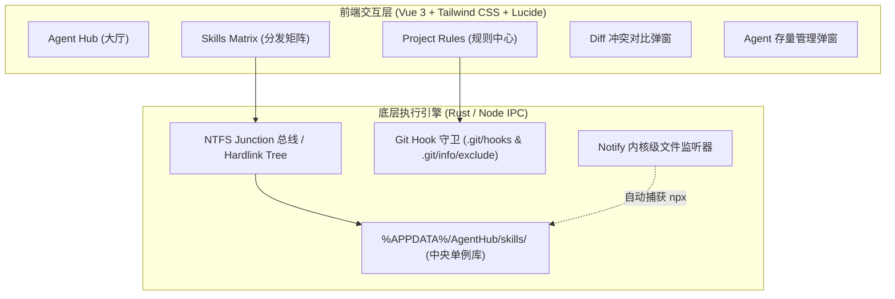

# AgentHub (AGENT_CONFIG_MANAGE)

<p align="center">
  <strong>一站式跨 AI Coding Agent 统一配置调配中枢 · 中央 Skills 软链分发矩阵 · 项目规则零 Git 冲突双模引擎</strong>
</p>

<p align="center">
  <a href="#-核心痛点与解决思路">核心痛点</a> ·
  <a href="#-支持的-16-大主流-ai-agent-全景矩阵">Agent 支持矩阵</a> ·
  <a href="#-四大核心功能系统">核心功能</a> ·
  <a href="#-架构设计">架构设计</a> ·
  <a href="#-快速开始">快速开始</a> ·
  <a href="#-开发与构建">开发与构建</a>
</p>

<p align="center">
  <a href="https://github.com/Nomit8088/AGENT_CONFIG_MANAGE/releases"></a>
  
  
  
  
</p>

---

## 📖 项目概述

随着开发者在日常编码中混合使用多款 AI Coding Agent（如 **Claude Code、Google Antigravity/Gemini、Cursor、Windsurf、OpenCode/Codex、ZCode、DeepSeek HARNESS、Trae** 等），本地开发环境往往面临严重的生态割裂与规则冲突。

**AgentHub** 是一款轻量、高颜值、跨平台的现代桌面客户端与中枢管理工具。通过 **Windows NTFS Junction / Symlink 软链技术**、**文件级 Hardlink Tree 双向同步引擎** 与 **Git Hook 守卫**，实现秒级跨 Agent 规则调配、中央技能库分发以及团队 Git 仓库规则零冲突。

---

## ⚡ 核心痛点与解决思路

| 痛点场景 | 传统方式面临的问题 | AgentHub 解决方案 |
|---|---|---|
| **团队 Git 规则冲突** | 团队代码仓库追踪了公共 `AGENTS.md`。本地开发者定制个人偏好直接修改该文件，切分支或 `git pull` 必出冲突；若仅靠 Prompt 提示“忽略”，原版内容依然注入上下文，浪费大量 Token 并干扰推理。 | **零 Git 冲突双模引擎**：<br>• **追加模式 (Append)**：原版 `AGENTS.md` 保持 0 修改，个性化规则精准分发至各 Agent 专属私有文件并自动写入 `.git/info/exclude`。<br>• **覆盖模式 (Overwrite)**：安全备份原版规则，并自动部署 Git Hook 守卫，在切分支或 pull 前后毫秒级自动还原与重载，0 冲突。 |
| **Skills / Commands 生态割裂** | 各 Agent 技能目录各异（`~/.claude/skills`、`~/.gemini/config/skills`、`~/.codex/skills`、`~/.dsh/skills-personal` 等），在一个 Agent 中编写的新 Skill 无法自动在其他 Agent 中复用。 | **中央技能库 Single Source of Truth**：<br>统一存放于 `%APPDATA%\AgentHub\skills\`，通过 Tag Pills 与智能浮层分发器，勾选即可秒级通过 NTFS Junction / Hardlink 挂载至任意 Agent。 |
| **存量技能无法纳管** | 各 Agent 目录下散落了手动编写或 npx 安装的实体技能文件夹，缺乏统一的可视化管理与冲突识别。 | **智能存量归类与冲突对比 (Diff)**：<br>自动按 Agent 聚合扫描未受控实体文件夹，提供一键批量纳管、私有忽略名单及同名版本 Diff 对比决策。 |
| **沙箱跳过软链导致失效** | 部分 Agent（如 Google Antigravity）在 Windows 下因安全策略会静默跳过带有 ReparsePoint 属性的 NTFS Junction 目录软链。 | **文件级 Hardlink Tree 架构**：<br>对 Antigravity 采用普通物理文件夹 + 内部文件 NTFS 硬链接树机制，共享物理 Inode，实现 0 磁盘冗余、0 延迟双向实时同步。 |

---

## 🤖 支持的 16 大主流 AI Agent 全景矩阵

AgentHub 原生深度适配主流 AI Agent 矩阵，严格按照各官方规范建立品牌图标、专属私有规则文件及多路径自动探测体系：

| Agent ID | 官方名称 | 技能目录 (`skillsDir`) | 原生识别的规则文件 | 主动读根目录 `AGENTS.md`? | 推荐本地覆盖文件 (`localRuleFilename`) | 官方品牌色 |
|---|---|---|---|:---:|---|---|
| `claude-code` | **Claude Code** | `~/.claude/skills` | `CLAUDE.md` | ❌ | `CLAUDE.local.md` | Anthropic Coral (`#D97757`) |
| `cursor` | **Cursor** | `~/.cursor/skills` | `.cursorrules`、`.cursor/rules/*.mdc` | ❌ | `.cursor/rules/local-override.mdc` | Sky Blue (`#38BDF8`) |
| `windsurf` | **Windsurf** | `~/.windsurf/skills` | `.windsurfrules`、`WINDSURF.local.md` | ❌ | `WINDSURF.local.md` | Codeium Teal (`#0D9488`) |
| `antigravity` | **Google Antigravity** | `~/.gemini/config/skills` | `GEMINI.md`、`.agents/rules/*.md`、`AGENTS.md` | ✅ | `.agents/rules/local-override.md` | Gemini Gradient (`#4E82EE` → `#10B981`) |
| `codex` | **OpenCode / Codex** | `~/.codex/skills` | `AGENTS.md`、`AGENTS.override.md` | ✅ | `AGENTS.override.md` | OpenAI Green (`#10A37F`) |
| `zcode` | **ZCode** | `~/.zcode/skills` | `ZCODE.local.md`、`AGENTS.md` | ✅ | `ZCODE.local.md` | Matrix Indigo (`#818CF8`) |
| `dsh` | **DeepSeek HARNESS** | `~/.dsh/skills-personal` | `AGENTS.md`、`CLAUDE.md` | ✅ | `AGENTS.local.md` | DeepSeek Blue (`#4D6BFE`) |
| `mimocode` | **MiMo Code** | `~/.config/mimocode/skills` | `AGENTS.md`、`CLAUDE.md`、`mimocode.json` | ✅ | `AGENTS.md` | Xiaomi Orange (`#FF6900`) |
| `openclaw` | **OpenClaw** | `~/.openclaw/skills` | `AGENTS.md`、`SOUL.md`、`IDENTITY.md` | ✅ | `AGENTS.md` | Cyber Claw (`#F97316`) |
| `hermes` | **Hermes Agent** | `~/.hermes/skills` | `.hermes.md`、`AGENTS.override.md`、`AGENTS.md` | ✅ | `AGENTS.override.md` | Amber Gold (`#F59E0B`) |
| `copilot` | **GitHub Copilot** | `~/.copilot/skills` | `.github/copilot-instructions.md`、`AGENTS.md` | ✅ | `.github/copilot-instructions.md` | GitHub Purple (`#8957E5`) |
| `pi` | **Pi Coding Agent** | `~/.pi/skills` | `.omo/rules/`、`AGENTS.md`、`CLAUDE.md` | ✅ | `.omo/rules/local.md` | Green Pi (`#22C55E`) |
| `kimi` | **Kimi Code CLI** | `~/.kimi/skills` | `AGENTS.md` (根+子目录)、`~/.kimi/AGENTS.md` | ✅ | `AGENTS.md` | Moonshot Indigo (`#6366F1`) |
| `trae` | **Trae / TraeWork** | `~/.trae/skills` | `.trae/rules/`、`AGENTS.md`、`CLAUDE.local.md` | ✅ | `CLAUDE.local.md` | Prism Green (`#32F08C`) |
| `workbuddy` | **WorkBuddy** | `~/.workbuddy/skills` | `AGENTS.md`、Codex 指令 | ❓ | `AGENTS.md` | Robot Blue (`#3B82F6`) |
| `kiro` | **Kiro CLI** | `~/.kiro/skills` | `~/.kiro/agents/*`、`AGENTS.md`、`AmazonQ.md` | ✅ | `AGENTS.md` | Magenta Gradient (`#E056FD`) |

---

## 🛠️ 四大核心功能系统



### 1. Agent Hub (智能体大厅)
- **环境自动探测**：启动时自动扫描本机是否已安装对应 Agent 的工作区目录；
- **分区分流展示**：将 Agent 清晰划分为「已启用 Agent 矩阵」与「未启用 / 待激活」两个区域；
- **全局隔离原则**：在 Agent Hub 中关闭的 Agent 会在技能矩阵与规则中心中完全隐藏，减少界面杂讯与误操作；
- **自定义扩展**：支持添加私有或定制 Agent，实时校验路径格式与 NTFS Junction 软链支持。

### 2. Skills Matrix (技能分发矩阵)
- **Tag Pills + Teleported 智能选择浮层**：摒弃无限横向扩展的传统表格，采用紧凑药丸徽章搭配绝对定位智能翻转浮层；
- **全维度检索与筛选**：支持按名称、描述、Tag 标签、斜杠命令模糊检索，并支持来源（内置/中央/NPX/存量）与分发状态筛选；
- **双视图自由切换**：支持表格视图与卡片画廊视图（Card View），偏好自动持久化至本地；
- **全自动捕获闭环**：内置文件监听守护，外部执行 `npx skills add -g` 时自动捕获并录入中央库。

### 3. Project Rules (项目规则中心)
- **双栏直观对比**：左栏展示团队基准 `AGENTS.md`（只读参考），右栏为本地个性化 Markdown 编辑器；
- **追加模式 (Append)**：写入各 Agent 专属私有文件（`CLAUDE.local.md`、`ZCODE.local.md` 等），自动添加至 `.git/info/exclude`，**0 Git 修改、0 冲突**；
- **覆盖模式 (Overwrite)**：替换工作区 `AGENTS.md` 为自定义内容，同时自动部署 `pre-checkout` 与 `post-checkout` Git Hook，在切分支或 pull 时毫秒级还原原版，切完后立即重新应用。

### 4. 存量物理 Skill 检测与冲突决策 (Diff Modal)
- **自动检测未受控实体**：按 Agent 聚合扫描存在的独立实体文件夹；
- **同名冲突智能比对**：发现与中央库同名但内容不同的技能时，提供双栏 Diff 语法高亮对比；
- **一键决策策略**：支持「覆盖现有版本 (Overwrite)」、「保留两者并重命名 (Rename)」及「跳过 (Skip)」，决策后自动替换为软链。

---

## 🎨 视觉与交互设计

- **深色 / 浅色 / 跟随系统三态主题**：全面支持浅色与深色模式，浅色模式采用纯净清爽的白灰工业质感与高对比度排版，深色模式采用深邃沉浸的毛玻璃光影；
- **真实官方品牌矢量图标体系**：全量重绘 16 款 Agent 官方高精度矢量 SVG 图标（Anthropic 14 角星芒、Gemini 四角渐变星、OpenAI 漩涡、Cursor 3D 立方体透视、Windsurf 浪花等）；
- **响应式微动画**：呼吸状态指示灯、平滑抽屉展开、浮动操作通知 Toast。

---

## 📂 存储与目录规范

AgentHub 的核心数据完全保存在本地系统目录中，**不污染任何用户项目代码仓库**：

- **Windows 存储路径**：`%APPDATA%\AgentHub\`（即 `C:\Users\<username>\AppData\Roaming\AgentHub\`）
- **Linux / macOS 路径**：`~/.config/agenthub/`

```text
%APPDATA%\AgentHub\
├── config.json               # 客户端全局配置 (自启、主题、默认模式、忽略技能列表)
├── agents.json               # 注册 Agent 列表及路径配置
├── projects.json             # 已纳管项目列表与规则配置
├── skills\                   # 中央技能库 (Single Source of Truth)
│   ├── archify\
│   │   └── SKILL.md
│   ├── obsidian-sync\
│   │   └── SKILL.md
│   └── agenthub-sync\
│       └── SKILL.md
└── backups\                  # 项目原版规则安全镜像备份
    └── <project-id>\
        ├── AGENTS.md.orig
        └── CUSTOM_AGENTS.md
```

---

## 🚀 快速开始

### 1. 克隆与安装依赖

```bash
# 克隆仓库
git clone https://github.com/Nomit8088/AGENT_CONFIG_MANAGE.git
cd AGENT_CONFIG_MANAGE

# 安装前端依赖
npm install
```

### 2. Web 开发模式 (推荐日常调试)

AgentHub 拥有独特的 **Dual-Mode 双运行架构**。在浏览器 Web 模式下，Vite 内置的 Node 本地系统插件（`src/server/localApi.ts`）同样直接触发真实的 Windows NTFS Junction 与文件写入，保证与真机环境 100% 一致：

```bash
npm run dev
```
启动后在浏览器打开 `http://localhost:1420` 即可开始使用。

### 3. Tauri 桌面端开发与打包

> 提示：编译 Tauri 桌面端需要本地安装 [Rust 工具链](https://www.rust-lang.org/)。

```bash
# 启动 Tauri 桌面调试窗口
npm run tauri dev

# 打包发布 Windows 独立可执行安装包 (.exe / .msi)
npm run tauri build
```

---

## 🛠️ 项目结构索引

```text
├── builtin-skills/                     # 内置技能模板
│   └── agenthub-sync/SKILL.md          # 反向同步命令技能
├── src/                                # 前端源码 (Vue 3 + TS + Tailwind)
│   ├── types/index.ts                  # 全局 TypeScript 数据模型
│   ├── stores/useAppStore.ts           # Pinia 全局响应式状态机
│   ├── services/api.ts                 # Dual-Mode IPC 适配层 (Tauri ↔ Web API)
│   ├── server/localApi.ts              # Web 模式下的 Node 原生系统操作层 (NTFS/Git)
│   └── components/
│       ├── Header.vue                  # 顶部导航与状态监测
│       ├── Navigation.vue              # 核心模块切换栏
│       ├── AgentBrandIcon.vue          # 16 款 Agent 官方高精度矢量图标
│       ├── AgentCard.vue               # Agent 卡片 (已启用 / 未启用双模卡片)
│       ├── AgentsView.vue              # Agent Hub 主视图
│       ├── SkillsMatrix.vue            # Skills 矩阵与分发中枢
│       ├── UnmanagedGroupSection.vue   # 本地存量检测与分类管理
│       ├── AgentDetailModal.vue        # 存量待纳管/已忽略双 Tab 弹窗
│       ├── AgentPillPicker.vue         # Teleported 智能翻转多选分发器
│       ├── SkillDrawer.vue             # 技能 Markdown 详情抽屉
│       ├── SkillEditorModal.vue        # SKILL.md 编辑与创建弹窗
│       ├── ProjectsView.vue            # 项目规则中心
│       ├── ProjectEditor.vue           # 双栏规则编辑器 (追加/覆盖双模)
│       ├── DiffModal.vue               # Diff 双栏冲突决策弹窗
│       ├── SettingsModal.vue           # 全局偏好与主题设置
│       └── ToastContainer.vue          # 全局浮动操作提示
└── src-tauri/                          # Rust 桌面端源码 (Tauri 2.0)
    ├── Cargo.toml                      # Rust 依赖配置
    ├── src/
    │   ├── lib.rs                      # Tauri Command 注册与分发
    │   ├── models.rs                   # Rust 数据结构
    │   ├── fs_junction.rs              # Windows NTFS Junction / Hardlink 驱动
    │   ├── git_guard.rs                # Git Hook 注入与还原引擎
    │   ├── agent_detector.rs           # 本地 Agent 探测与路径校验
    │   ├── storage.rs                  # %APPDATA%\AgentHub 本地持久化
    │   └── watcher.rs                  # Notify 内核级文件监听后台线程
    └── tauri.conf.json                 # Tauri 客户端窗口配置
```

---

## 🗺️ 后续演进计划 (Roadmap)

- [ ] **MCP Server 配置总线**：集中可视化管理与跨 Agent 共享多 Agent 的 MCP Server（`claude_desktop_config.json`, `gemini/mcp`, `codex/mcp` 等）；
- [ ] **Skills 市场生态导入**：支持一键从 GitHub / npm 官方 skills 生态中检索并下载至中央库；
- [ ] **CodeMirror 6 嵌入双栏 Diff**：在 ProjectEditor 与 DiffModal 中引入行级实时对比编辑器；
- [ ] **系统托盘常驻**：Tauri 2.0 增加系统托盘图标、托盘快捷菜单与全局快捷键唤起。

---

## 📄 开源许可证

本项目基于 [MIT License](LICENSE) 协议开源。