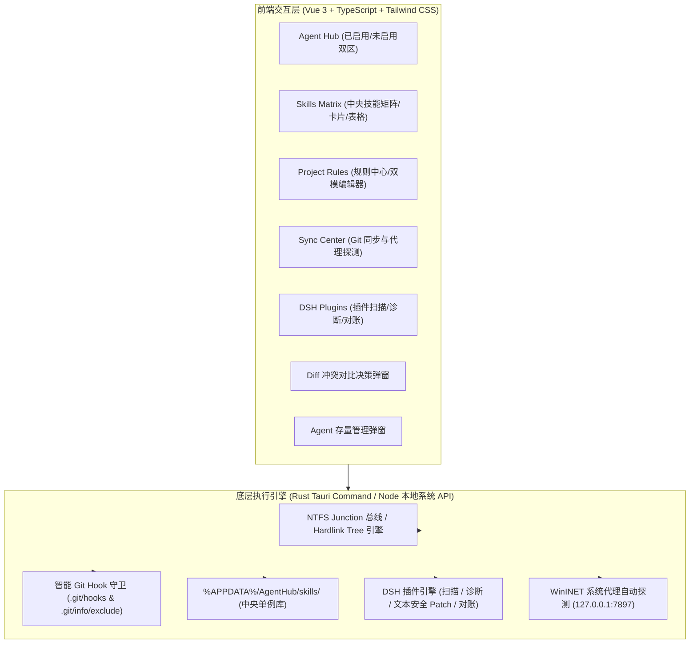
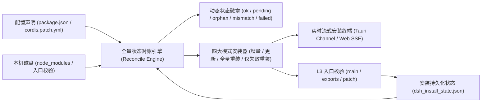

# AgentHub (AGENT_CONFIG_MANAGE)

<p align="center">
  <strong>跨 AI Coding Agent 统一配置中枢 · 中央 Skills 软链矩阵 · 零 Git 冲突规则引擎 · DSH 插件全生命周期管理</strong>
</p>

<p align="center">
  <a href="README.md">简体中文</a> |
  <a href="README.en.md">English</a>
</p>

<p align="center">
  <a href="https://github.com/Nomit8088/AGENT_CONFIG_MANAGE/releases"></a>
  
  
  
  
  
</p>

---

## 📖 项目概述

在日常 AI 辅助软件研发中，开发者通常组合使用多款 AI Coding Agent（**Claude Code、Google Antigravity、Cursor、Windsurf、OpenCode/Codex、ZCode、DeepSeek HARNESS (DSH)、Trae、GitHub Copilot** 等）。然而随着工具增多，本地开发环境面临以下严峻痛点：
- **团队 Git 规则冲突**：团队代码库统一追踪全局 `AGENTS.md` / `CLAUDE.md`，本地个性化配置直接修改会导致分支切换或 `git pull` 频繁冲突；
- **Skills / Commands 生态割裂**：各 Agent 技能目录各异（`~/.claude/skills`、`~/.gemini/config/skills`、`~/.codex/skills`、`~/.dsh/skills` 等），在一个 Agent 中沉淀的 Skill 无法跨端自动共享；
- **沙箱目录软链静默失效**：Google Antigravity 在 Windows 下出于安全隔离策略，会静默跳过带有 `FILE_ATTRIBUTE_REPARSE_POINT` 的 NTFS 目录软链；
- **DSH 插件生态缺乏可视化管理**：DeepSeek HARNESS (DSH) 插件分散在配置与 patch 文件中，排查 `dsh web` 启动崩溃困难，且多设备间配置难以对账与自动安装。

**AgentHub** 是一款轻量、高颜值、极速响应的跨 Agent 统一桌面客户端。基于 **Tauri 2.0 (Rust) + Vue 3 / TypeScript** 构建，拥有独特的 **Dual-Mode 双运行架构**，通过 **Windows NTFS Junction / Symlink**、**文件级 Hardlink Tree 双向同步引擎**、**智能 Git Hook 守卫** 与 **DSH 插件全生命周期管理器**，实现秒级跨 Agent 规则调配、中央技能库分发与团队 Git 仓库零冲突隔离。

---

## 🎯 核心痛点与解决思路

| 痛点场景 | 传统方式与弊端 | AgentHub 创新解决方案 |
|---|---|---|
| **团队 Git 冲突与污染** | 团队仓库追踪了公共 `AGENTS.md` / `CLAUDE.md`。本地修改该文件定制个人偏好，切分支或 `git pull` 必出冲突；靠 Prompt 提示忽略依然注入上下文浪费 Token，误提交更会污染团队基线。 | **零 Git 冲突双模式**：<br>🔹 **追加模式 (Append)**：基线文件 100% 物理未修改，个性化规则精准分发至 Agent 专属私有覆盖文件（`CLAUDE.local.md`、`AGENTS.local.md`、`.agents/rules/` 等），自动注入 `.git/info/exclude`，免 Hook 零冲突。<br>🔹 **覆盖模式 (Overwrite)**：安全备份原版基线，自动注入 `pre-checkout` / `post-checkout` Hook 实现切分支秒级还原团队原版，注入 `pre-commit` 拦截误提交并提供手动放行开关。 |
| **Skills / Commands 生态割裂** | 各 Agent 技能目录各异（`~/.claude/skills`、`~/.gemini/config/skills`、`~/.codex/skills`、`~/.dsh/skills` 等），新写技能需手动反复复制，各端版本漂移且维护成本极高。 | **中央技能库 Single Source of Truth**：<br>统一保存在 `%APPDATA%\AgentHub\skills\`，通过 Tag Pills 与 Teleported 智能翻转多选分发器，一键建立 NTFS Junction / Hardlink 矩阵分发至各目标 Agent。 |
| **沙箱目录软链加载失效** | Google Antigravity 在 Windows 下出于安全防循环策略，会静默跳过带有 `FILE_ATTRIBUTE_REPARSE_POINT` 的目录软链（NTFS Junction），导致技能无法感知。 | **文件级 Hardlink Tree 引擎**：<br>针对 Antigravity 采用「物理文件夹 + 内部文件级 NTFS 硬链接（`mklink /H`）」机制，共享底层 Inode，实现 0 拷贝、0 延迟、100% 原生识别且双向实时同步。 |
| **存量技能分散未纳管** | 各 Agent 目录下散落大量历史手动编写或 npx 安装的物理技能文件夹，缺乏统一可视与冲突识别手段。 | **存量检测与双栏 Diff 冲突决策**：<br>自动跨 Agent 扫描未纳管的物理文件夹，支持一键批量纳管、标记私有忽略（`ignored_skills`）、同名版本双栏 Diff 冲突对比（覆盖/重命名/跳过）。 |
| **多设备跨端同步与网络代理** | 多台开发机之间 Skills 难以同步，国内环境访问 GitHub 经常遭遇直连 reset 或代理配置繁琐。 | **同步中心 (Sync Center) + 代理自动探测**：<br>以 `%APPDATA%\AgentHub` 为 Git 根同步 `skills/` 与 `dsh/` 镜像，自动探测 Windows WinINET 系统代理（如 `127.0.0.1:7897`），支持快照自检与 Fast-forward 安全拉取。 |
| **DSH 插件管理排障困难** | DeepSeek HARNESS (DSH) 插件分散在 `package.json` 与 `cordis.patch.yml` 中，启动崩溃堆栈难以排查，多设备依赖与 patch 容易漂移。 | **DSH 插件中心 (DSH Plugin Manager)**：<br>提供本地插件可视化扫描（Bundle/依赖/Patch/可移植性标记）、启动崩溃 stderr 自动诊断修复、文本级安全 Patch 写入，以及与技能库共用 Git 仓库的配置同步与对账。 |

---

## 🌐 支持的 16 大 AI Agent 全景矩阵

AgentHub 原生深度适配 16 大主流 AI Agent，严格按照各家官方规范绘制高精度品牌矢量 SVG 图标、原生私有覆盖规则文件及路径自动探测体系：

| Agent ID | 官方名称 | 技能目录 (`skillsDir`) | 原生识别的规则文件 | 主动读根目录 `AGENTS.md`? | 推荐本地覆盖文件 (`localRuleFilename`) | 官方品牌色与图标规范 |
|---|---|---|---|:---:|---|---|
| `claude-code` | **Claude Code** | `~/.claude/skills` | `CLAUDE.md` | ❌ | `CLAUDE.local.md` | Anthropic Coral 14-spoke Sunburst (`#D97757`) |
| `cursor` | **Cursor** | `~/.cursor/skills` | `.cursorrules`、`.cursor/rules/*.mdc` | ❌ | `.cursor/rules/local-override.mdc` | 3D Isometric Cube & Arrow (`#38BDF8`) |
| `windsurf` | **Windsurf** | `~/.windsurf/skills` | `.windsurfrules`、`WINDSURF.local.md` | ❌ | `WINDSURF.local.md` | Codeium Teal Ocean Wave (`#0D9488`) |
| `antigravity` | **Google Antigravity** | `~/.gemini/config/skills` | `GEMINI.md`、`.agents/rules/*.md`、`AGENTS.md` | ✅ | `.agents/rules/local-override.md` | Google AI 4-Point Gradient Star (`#4E82EE` → `#10B981`) |
| `codex` | **OpenCode / Codex** | `~/.codex/skills` | `AGENTS.md`、`AGENTS.override.md` | ✅ | `AGENTS.override.md` | OpenAI Ribbon Swirl Vortex (`#10A37F`) |
| `zcode` | **ZCode** | `~/.zcode/skills` | `ZCODE.local.md`、`AGENTS.md` | ✅ | `ZCODE.local.md` | Matrix High-Tech Indigo (`#818CF8`) |
| `dsh` | **DeepSeek HARNESS** | `~/.dsh/skills` | `AGENTS.md`、`CLAUDE.md` | ✅ | `AGENTS.local.md` | DeepSeek Official Whale (`#4D6BFE`) |
| `mimocode` | **MiMo Code** | `~/.config/mimocode/skills` | `AGENTS.md`、`CLAUDE.md`、`mimocode.json` | ✅ | `AGENTS.md` | Xiaomi Intelligence Orange (`#FF6900`) |
| `openclaw` | **OpenClaw** | `~/.openclaw/skills` | `AGENTS.md`、`SOUL.md`、`IDENTITY.md` | ✅ | `AGENTS.md` | Cybernetic Claw Badge (`#F97316`) |
| `hermes` | **Hermes Agent** | `~/.hermes/skills` | `.hermes.md`、`AGENTS.override.md`、`AGENTS.md` | ✅ | `AGENTS.override.md` | Nous Research Winged Helm (`#F59E0B`) |
| `copilot` | **GitHub Copilot** | `~/.copilot/skills` | `.github/copilot-instructions.md`、`AGENTS.md` | ✅ (Coding Agent) | `.github/copilot-instructions.md` | GitHub Purple Pilot Robot (`#8957E5`) |
| `pi` | **Pi Coding Agent** | `~/.pi/skills` | `.omo/rules/`、`AGENTS.md`、`CLAUDE.md` | ✅ (需 pi-rules) | `.omo/rules/local.md` | Inflection Green Pi Symbol (`#22C55E`) |
| `kimi` | **Kimi Code CLI** | `~/.kimi/skills` | `AGENTS.md` (根+子目录)、`~/.kimi/AGENTS.md` | ✅ | `AGENTS.md` | Moonshot Indigo Star Burst (`#6366F1`) |
| `trae` | **Trae / TraeWork** | `~/.trae/skills` | `.trae/rules/`、`AGENTS.md`、`CLAUDE.local.md` | ✅ (需开启) | `CLAUDE.local.md` | ByteDance Prism Cyan (`#00E5FF`) |
| `workbuddy` | **WorkBuddy** | `~/.workbuddy/skills` | `AGENTS.md`、Codex 指令 | ❓ (依赖配置) | `AGENTS.md` | Collaboration Robot Blue (`#3B82F6`) |
| `kiro` | **Kiro CLI** | `~/.kiro/skills` | `~/.kiro/agents/*`、`AGENTS.md`、`AmazonQ.md` | ✅ | `AGENTS.md` | Amazon Q Magenta Gradient (`#E056FD`) |

> **💡 DSH 多技能根目录 (Multi-Root Skills) 特性支持**：  
> DSH 的 `skill-filesystem` 默认同时扫描用户级 `~/.dsh/skills` 与 `~/.agents/skills`。AgentHub 以 `~/.dsh/skills` 作为 DSH 的主管理目录；在启用/停用/删除/纳管时，AgentHub 协同联动清理所有用户级技能根目录，确保 Skills Matrix 开关对 DSH 100% 即时生效。

---

## 🏗️ 核心系统架构与交互



### 1. Agent Hub (Agent 状态大厅)
- **双模卡片分流**：直观划分「已启用 Agent 矩阵」与「未启用 / 待激活 Agent」，支持关键词检索与一键批量激活；
- **全自动探测**：启动时自动扫描本地磁盘，精准校验 16 款 Agent 的安装状态、配置路径与私有规则支持情况。

### 2. Skills Matrix (技能分发矩阵与单例库)
- **Tag Pills + Teleported 智能多选分发**：告别繁琐设置，点击药丸徽章即可秒级挂载/卸载目标 Agent；
- **全维度检索与视图切换**：支持按名称、描述、Tag 标签、斜杠命令模糊检索，按来源（内置/中央/NPX/存量）和分发状态筛选，支持卡片画廊（Card View）与表格视图自由切换；
- **全局文件监听守护**：后台通过内核级 `notify` 文件监听线程自动感知外部技能变动。

### 3. Project Rules (项目规则中心)
- **多基线规则纳管**：全面纳管 `AGENTS.md`、`CLAUDE.md`、`.cursorrules`、`.windsurfrules` 等多生态团队基线；
- **追加模式 (Append)**：
  - 团队基线文件 **100% 物理未修改**；
  - 规则精准分发至已选 Agent 专属私有覆盖文件（如 `CLAUDE.local.md`、`AGENTS.local.md`、`ZCODE.local.md` 等）；
  - 自动将私有规则写入 `.git/info/exclude`，**免 Hook、零 Git 冲突**；
- **覆盖模式 (Overwrite)**：
  - 替换基线文件为自定义内容，同时**强制清空所有私有覆盖文件**，防止双重规则注入；
  - 自动注入 `pre-checkout` 与 `post-checkout` Hook，切分支/pull 时秒级还原团队原版内容；
  - 自动注入 `pre-commit` 提交拦截守卫，检测到暂存区包含本地定制规则时阻止提交，并在 UI 提供 **`[ 开启拦截 (防误提) | 允许提交 (放行) ]`** 分段滑块开关与 **「⚡ 一键安装/修复 Git Hook」** 按钮。

### 4. 存量技能检测与双栏 Diff 冲突决策
- **自动多端探测**：跨 Agent 综合扫描未纳管的物理实体文件夹；
- **双栏 Diff 高亮对比**：当存量技能与中央库发生同名内容冲突时，弹出直观的双栏对比；
- **四维决策支持**：支持「覆盖为中央版本 (Overwrite)」、「重命名入库 (Rename)」、「跳过 (Skip)」，并在决策后秒级转换为软链/硬链；
- **私有忽略名单**：支持将特定私有技能标记为忽略（`ignored_skills`），杜绝提示噪音。

### 5. 同步中心 (Sync Center & 网络代理自愈)
- **中央技能库 Git 同步**：以 `%APPDATA%\AgentHub` 为 Git 根，仅同步 `skills/` 与 `dsh/` 配置镜像，支持 GitHub / Gitee / GitLab 等远程仓库；
- **Windows 系统代理自愈**：自动探测 WinINET 注册表代理（如 `127.0.0.1:7897`），向 Git 命令自动注入 `-c http.proxy / -c https.proxy`，攻克 GitHub 直连 reset 痛点；
- **安全快照与 Fast-forward**：内置 `ls-remote` 连通性测试与纯快进（fast-forward）安全拉取，冲突全流程预警。

### 6. DSH 插件中心 (DSH Plugin Manager)
- **本地可视化扫描 (Plugin Panel)**：扫描 `~/.dsh/profiles/*`，精准识别内置 Bundle（`@deepseek-ai/dsh-*`）、用户 Bundle、纯依赖与 Patch 行，标注可移植性（`link:` / `file:` / `git+` 警告）；
- **启动失败诊断与一键修复 (Diagnose & Recovery)**：捕获 `dsh web` 启动崩溃 stderr（15s 超时 + 强制杀进程树），智能解析失败插件名与推荐动作，精准辨别 `EADDRINUSE` 端口占用；
- **配置同步与对账 (Sync & Reconcile)**：将 `package.json` + `cordis.patch.yml` + `pnpm-lock.yaml` 镜像至同步仓库（`dsh/profiles/<name>`），提供差异对比与「一键对齐 + 自动 pnpm install」；
- **文本级安全 Patch 写入**：`cordis.patch.yml` 纯文本级追加/删除，保留所有注释与 `!!js` 标签，绝不使用破坏性的全文件 `yaml.dump`。

---

## ⚡ 即将实施：DSH 插件面板 V2 演进方案

> 📌 **方案详见**：[**PLAN_DSH_PLUGIN_PANEL_V2.md**](PLAN_DSH_PLUGIN_PANEL_V2.md)

为了将 DSH 插件面板从「只读配置声明展示」升级为**「配置 ↔ 本机磁盘 ↔ 安装结果」三方对账与全功能安装器**，AgentHub 规划了四大核心增强：



| 增强模块 | 设计规范与能力亮点 |
|---|---|
| **P1. 全量状态对账 (Reconciliation View)** | 🔹 **对账条目**：条目 = 配置声明 ∪ 本机 `node_modules` ∪ 持久化状态；<br>🔹 **五态徽章**：`ok`（正常已装）、`pending`（配置已声明但未装）、`orphan`（磁盘孤儿/多余）、`version-mismatch`（版本不一致）、`failed`（上次安装失败）；<br>🔹 **豁免机制**：内置包 `@deepseek-ai/dsh-*`（`kind=inbox`）直接 ok 豁免；非语义化 spec（tarball URL / `git+`）豁免版本对比；`pnpm-lock.yaml` 严格限定扫描 `packages:` 段避免 URL 误报；磁盘健康时自动清除陈旧 `failed` 状态。 |
| **P2. 四大模式安装器 (Multi-Mode Installer)** | 🔹 **增量安装 (`incremental`)**：执行 `pnpm install`，只安装缺失与变更项（默认安全推荐）；<br>🔹 **按 Spec 更新 (`update`)**：执行 `pnpm update`，在 spec 声明范围内升级至最新版本；<br>🔹 **全量重新安装 (`reinstall-all`)**：执行 `pnpm install --force` 全量重拉（支持二次确认模态）；<br>🔹 **仅失败重装 (`reinstall-failed`)**：针对上次持久化失败的包执行精准强制重装。 |
| **P3. 失败持久化与 L3 逐包深度校验** | 🔹 **L3 深度校验**：安装完成后逐包检查 `node_modules/<pkg>/package.json` 中的 `main` / `exports` 与 `dsh.bundle.patch` 入口文件是否存在，精准捕获“pnpm 退出码 0 但安装的是源码残包”的隐蔽故障；<br>🔹 **状态持久化**：失败原因与截断堆栈持久化至 `%APPDATA%\AgentHub\dsh_install_state.json`，自动加入 `.gitignore` 避免污染 Git 同步，UI 支持一键呼出查看完整堆栈。 |
| **P4. 实时流式安装终端 (Streaming Terminal)** | 🔹 **双端流式输出**：Tauri 桌面端采用 `Channel<String>`，Web 浏览器开发模式采用 Server-Sent Events (SSE)；<br>🔹 **`DshInstallTerminal.vue` 终端组件**：macOS 极简暗灰浮层、等宽字体实时输出、运行状态指示与自动滚动。 |

---

## 🎨 视觉与交互设计规范

AgentHub 严格遵循 [**DESIGN_GUIDELINES.md**](file:///d:/dev/toolPrograms/agent_config_manager/DESIGN_GUIDELINES.md) 中的 **macOS Vibrancy (毛玻璃极简)** 工业美学：

- **三层暗灰纯色阶体系**：
  - 底层画布（Canvas）：`#1c1c1e`
  - 中层卡片（Mid Layer）：`#2c2c2e`
  - 浅交互层（Surface）：`#3a3a3c`
  - 毛玻璃层（Vibrancy）：`backdrop-blur-xl` 配合 `bg-[#1c1c1e]/80` 或 `bg-[#1c1c1e]/95`
- **深浅双色无缝兼容**：浅色模式采用纯净白灰底色（`#f5f5f7` / `#ffffff` / `text-slate-900`），深浅模式均保持高对比度与精致微投影；
- **排版规范**：标题统一采用 **Serif 衬线体 (`font-serif`)** 展现人文典雅感，正文采用系统无衬线体，代码/路径采用 **等宽体 (`font-mono`)**；
- **1px 发丝线细边框**：全站统一使用 `border-white/8` ~ `border-white/12`（浅色为 `border-black/8`），严禁 2px/4px 粗边框；
- **macOS 分段滑块开关 (Segmented Slider)**：全站所有开关统一采用 `[ 开启 / 启用 | 关闭 / 停用 ]` 双段滑块控制；
- **动效规范**：过渡统一使用 `transition-colors duration-200 ease-out`，严禁悬停位移、缩放与装饰性大圆角（禁止 `rounded-3xl` / `rounded-full`，卡片统一 `rounded-xl`）。

---

## 💾 数据模型与本地存储规范

AgentHub 的核心数据与技能库独立保存在系统本地目录中，**绝不与任何业务 Git 仓库产生硬耦合**：

- **Windows 路径**：`%APPDATA%\AgentHub\`（即 `C:\Users\<username>\AppData\Roaming\AgentHub\`）
- **Linux / macOS 路径**：`~/.config/agenthub/`

```text
%APPDATA%\AgentHub\
├── config.json               # 客户端全局设置 (主题、默认模式、忽略列表、同步配置)
├── agents.json               # 已注册 Agent 列表与路径映射规则
├── projects.json             # 已纳管项目列表与自定义规则配置
├── dsh_install_state.json    # DSH 插件安装持久化运营状态 (失败堆栈/缓存，已加入 .gitignore)
├── skills\                   # 中央技能库 (Single Source of Truth)
│   ├── obsidian-sync\
│   │   └── SKILL.md
│   ├── archify\
│   │   └── SKILL.md
│   └── agenthub-sync\
│       └── SKILL.md
├── dsh\                      # DSH 插件配置镜像仓库 (与 skills 共用 Git 根)
│   └── profiles\<name>\
│       ├── package.json     # 已清洗的配置 (剔除内置与不可移植项)
│       ├── cordis.patch.yml # 纯文本 Patch 镜像
│       └── pnpm-lock.yaml   # 依赖锁文件
└── backups\                  # 项目原版规则安全镜像备份
    └── <project-id>\
        ├── AGENTS.md.orig
        └── CUSTOM_AGENTS.md
```

---

## 🚀 快速开始

### 1. 克隆与安装依赖

```bash
# 克隆仓库
git clone https://github.com/Nomit8088/AGENT_CONFIG_MANAGE.git
cd AGENT_CONFIG_MANAGE

# 安装前端依赖
npm install
```

### 2. Web 开发模式 (推荐日常快速调试)

AgentHub 拥有独特的 **Dual-Mode 双运行架构**。在 Web 模式下，Vite 内置的 Node 本地系统 API（`src/server/localApi.ts`）同样直接操作真实 Windows NTFS Junction、Hardlink 与 Git Hook，保证体验 100% 一致：

```bash
npm run dev
```
浏览器打开 `http://localhost:1420` 即可开始使用。

### 3. Tauri 桌面端开发与打包

> 💡 提示：编译 Tauri 桌面端需要本地安装 [Rust 工具链与 Cargo](https://www.rust-lang.org/)。

```bash
# 启动 Tauri 桌面调试窗口
npm run tauri dev

# 打包发布 Windows 独立可执行安装包 (.exe / .msi)
npm run tauri build
```

---

## 🗂️ 项目结构导航

```text
├── builtin-skills/                   # 内置技能模板
│   └── agenthub-sync/SKILL.md        # 反向同步技能定义 (/agenthub-sync)
│
├── src/                              # 前端源码 (Vue 3 + TS + Tailwind)
│   ├── types/index.ts                # 全局 TypeScript 接口模型定义
│   ├── stores/useAppStore.ts         # Pinia 全局响应式状态机
│   ├── services/api.ts               # Dual-Mode IPC 适配层 (Tauri ↔ Web API)
│   ├── server/
│   │   ├── localApi.ts               # Web 模式下的 Node 原生系统操作层 (NTFS/Hardlink/Git)
│   │   ├── dshPlugins.ts             # DSH 插件扫描 / 诊断 / 安全 Patch / 同步
│   │   └── gitSyncUtil.ts            # Git 同步与 WinINET 代理自动探测
│   ├── assets/style.css              # 全局 macOS Vibrancy 样式与自定义滚动条
│   └── components/
│       ├── Header.vue                # 顶部状态条 (状态统计、环境重扫、主题切换)
│       ├── Navigation.vue            # 核心五模块导航 Tab (Agent/Skills/Projects/Sync/Plugins)
│       ├── AgentBrandIcon.vue        # 16 大 Agent 官方高精度矢量 SVG 图标体系
│       ├── AgentCard.vue             # Agent 状态卡片 (已启用 / 未启用双模卡片)
│       ├── AgentsView.vue            # Agent Hub 视图 (分组展示与关键词检索)
│       ├── SkillsMatrix.vue          # Skills Matrix (全维度检索/来源筛选/卡片画廊/表格视图)
│       ├── SyncView.vue              # 同步中心 (Git 多端同步、系统代理探测、分支指示)
│       ├── UnmanagedGroupSection.vue # 存量技能归类卡片区 (支持批量纳管与私有忽略)
│       ├── AgentDetailModal.vue      # 存量管理弹窗 (待纳管 / 已忽略双 Tab)
│       ├── AgentPillPicker.vue       # Teleported 智能翻转多选分发器
│       ├── SkillDrawer.vue           # 技能右侧 Markdown 详情抽屉
│       ├── SkillEditorModal.vue      # SKILL.md 编辑与创建弹窗
│       ├── ProjectsView.vue          # 纳管项目列表与规则状态指示
│       ├── ProjectEditor.vue         # 双栏规则编辑器 (追加/覆盖双模式 + Git Hook 修复)
│       ├── DiffModal.vue             # Diff 语法高亮冲突决策弹窗
│       ├── PluginsView.vue           # DSH 插件中心容器 (插件面板 / 诊断修复 / 同步对账)
│       ├── DshPluginList.vue         # DSH 本地插件可视化扫描面板
│       ├── DshDiagnose.vue           # DSH 启动失败诊断修复面板 (崩溃堆栈一键自愈)
│       ├── DshPluginSync.vue         # DSH 插件配置同步与对账面板
│       ├── DshPluginDiffModal.vue    # DSH 插件对账差异详情弹窗
│       ├── SettingsModal.vue         # 全局偏好设置 (深色/浅色/跟随系统三态切换)
│       └── ToastContainer.vue        # 全局浮动操作通知
│
└── src-tauri/                        # Rust 桌面端源码 (Tauri 2.0)
    ├── Cargo.toml                    # Rust 依赖清单 (tauri, notify, serde, windows-sys)
    ├── tauri.conf.json               # Tauri 客户端窗口与权限安全策略
    └── src/
        ├── main.rs                   # 桌面可执行程序入口
        ├── lib.rs                    # Tauri Command 注册与分发接口
        ├── models.rs                 # Rust 数据结构体
        ├── fs_junction.rs            # Windows NTFS Junction 与 Hardlink Tree 驱动引擎
        ├── git_guard.rs              # 智能 Git Hook 注入、pre-commit 拦截与多基线安全还原
        ├── skills_sync.rs            # 中央技能库 Git 同步 (init/pull/push/status)
        ├── git_sync.rs               # Windows WinINET 代理自动探测与 Git 命令参数注入
        ├── dsh_plugins.rs            # DSH 插件扫描 / 诊断 / 文本 Patch / 卸载
        ├── dsh_plugins_sync.rs       # DSH 插件配置同步 / 镜像 / 对账 / 一键对齐
        ├── agent_detector.rs         # 16 大 Agent 探测与路径校验引擎
        ├── storage.rs                # %APPDATA%\AgentHub 本地持久化存储
        └── watcher.rs                # Notify 内核级文件监听后台线程
```

---

## 🗺️ 演进路线图 (Roadmap)

- [ ] **DSH 插件面板 V2 (状态对账 + 四大模式安装器 + L3 校验 + 实时终端)** `[设计已锁定 / 待实施]`
- [ ] **应用本体在线更新**：接入 Tauri Updater，支持检测 GitHub Releases 并一键下载安装；
- [ ] **MCP Server 统一总线**：集中管理与跨 Agent 共享 MCP Server（`claude_desktop_config.json`, `gemini/mcp`, `codex/mcp` 等）；
- [ ] **Skills 市场生态接入**：支持从 GitHub / npm 官方 skills 市场一键检索并安装到中央库；
- [ ] **CodeMirror 6 嵌入双栏 Diff**：在 ProjectEditor 与 DiffModal 中引入实时行级代码对比与合并；
- [ ] **系统托盘常驻与快捷键**：Tauri 2.0 增加系统托盘图标、托盘右键菜单与全局唤起快捷键。

---

## 📄 开源许可证

本项目基于 [MIT License](LICENSE) 协议开源。
