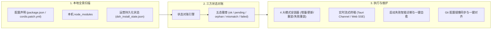

# AgentHub (AGENT_CONFIG_MANAGE)

<p align="center">
  <strong>跨 AI Coding Agent 统一配置中枢 · DSH 插件全生命周期管理 · 中央 Skills 软链矩阵 · 零 Git 冲突规则引擎</strong>
</p>

<p align="center">
  <a href="README.md">简体中文</a> |
  <a href="README.en.md">English</a>
</p>

<p align="center">
  <a href="https://github.com/Nomit8088/AGENT_CONFIG_MANAGE/releases/latest"></a>
  
  
  
  
  
</p>

> 💡 **即刻体验**：Windows 用户可直接前往 [**GitHub Releases**](https://github.com/Nomit8088/AGENT_CONFIG_MANAGE/releases/latest) 下载最新 `.exe` 安装包，开箱即用，无需配置 Node/Rust 开发环境！

---

## 📖 项目简介

在现代 AI 辅助研发中，开发者常混合使用多款 AI Coding Agent（**DeepSeek HARNESS (DSH)、Claude Code、Google Antigravity、Cursor、Windsurf、OpenCode/Codex、ZCode、Trae、GitHub Copilot** 等）。随着工具链的丰富，本地环境面临严重的配置碎片化问题：

1. **DSH 插件管理排障繁琐**：插件分散在 `package.json` 与 `cordis.patch.yml` 中，`dsh web` 启动崩溃难以定位，插件安装状态不透明，多设备间配置漂移且无法一键还原；
2. **跨 Agent Skills 生态割裂**：各 Agent 技能目录各异（`~/.dsh/skills`、`~/.claude/skills`、`~/.gemini/config/skills` 等），无法跨端实时共享；
3. **团队 Git 规则冲突**：团队代码库统一追踪 `AGENTS.md` / `CLAUDE.md`，本地定制规则容易引发 `git pull` / 切分支冲突或误提交污染团队基线；
4. **沙箱软链静默失效**：Google Antigravity 在 Windows 下会静默跳过 NTFS 目录软链。

**AgentHub** 是一款轻量、高颜值、极速响应的跨 Agent 统一桌面客户端。基于 **Tauri 2.0 (Rust) + Vue 3 / TypeScript** 构建，拥有独特的 **Dual-Mode 双运行架构**，深度集成了 **DSH 插件全生命周期管理器**、**中央 Skills 软链/硬链分发矩阵**、**零 Git 冲突规则引擎** 与 **应用本体在线更新**。

---

## 🧩 重磅功能：DSH 插件全生命周期管理 (DSH Plugin Manager)

AgentHub 针对 **DeepSeek HARNESS (DSH)** 提供了深度专属管理与排障支持，全面覆盖插件的**可视化全景、状态对账、多模式安装、启动崩溃诊断、安全写盘与多端同步**：



### 1. 本地插件可视化扫描与可移植性评估
- **全要素识别**：自动扫描 `~/.dsh/profiles/*`，精准识别官方内置 Bundle（`@deepseek-ai/dsh-*`）、用户 Bundle、纯依赖与 Patch 行；
- **可移植性预警**：自动分析依赖规格，将 `link:` / `file:` / `workspace:` / `catalog:` / `ssh:` 标记为不可移植依赖，方便排查多机同步隐患；
- **多维度视图**：支持按来源分组（官方内置 / 社区与个人 / 本地开发 / Patch 行）与按状态分组，提供健康胶囊快捷筛选及列表/卡片双视图切换。

### 2. 全量三方状态对账 (3-Way State Reconciliation)
- **精准五态徽章**：条目 = 配置声明 ∪ 本机磁盘 ∪ 持久化状态，状态一目了然：
  - 🟢 **`ok` 正常已装**：配置已声明且磁盘依赖与入口完整；
  - 🟡 **`pending` 待安装**：配置已声明但本机尚未安装；
  - 🟠 **`orphan` 磁盘孤儿**：磁盘存在但配置未声明，支持一键「纳入配置」或安全移除；
  - 🔴 **`version-mismatch` 版本冲突**：lockfile 锁定版本与本地安装版本不一致；
  - 🔴 **`failed` 安装失败**：上次安装失败，可一键查看截断错误堆栈并重试。
- **孤儿包智能纳管**：检测到孤儿包时，若为 Git 仓库自动提取远端地址生成 `git+https:` 规格，优先保障可移植性。

### 3. 四大模式安装器 & 实时流式终端
- **四大安装模式**：
  - **增量安装 (`incremental`)**：执行 `pnpm install`，仅安装缺失与变更依赖（安全默认）；
  - **按 Spec 更新 (`update`)**：执行 `pnpm update`，在 spec 约束范围内升级最新版本；
  - **全量重新安装 (`reinstall-all`)**：执行 `pnpm install --force` 全量重装（含二次确认）；
  - **仅失败重装 (`reinstall-failed`)**：精准对上次失败的包执行强制修复安装。
- **单包更新检查**：支持对 `git+https` / `github:` 规格插件调用 `git ls-remote` 检查远端最新 commit，一键升级；
- **L3 深度入口校验**：安装完成后逐包校验 `package.json` 中的 `main` / `exports` 与 `dsh.bundle.patch` 入口文件，杜绝“pnpm 退出码 0 但安装的是源码残包”的虚假成功；
- **实时流式终端**：Tauri 桌面端采用 `Channel<String>`，Web 开发模式采用 SSE，实时展示带语法高亮的安装控制台。

### 4. 启动失败一键诊断与自愈 (Crash Diagnosis)
- **崩溃现场抓取**：一键拉起 `dsh web` 并实时捕获 stderr 崩溃堆栈（15s 超时守护 + 进程树安全清理）；
- **智能错误识别**：精准解析崩溃根因（缺失依赖、入口异常、Patch 不兼容），自动提取故障插件名并给出处置建议；
- **一键停用与重试**：点击「关闭故障插件并重试」，秒级自动更新配置并重新验证启动状态；精准识别 `EADDRINUSE` 端口占用，避免误判插件故障。

### 5. 文本级安全 Patch 写入
- **保留注释与语法**：对 `cordis.patch.yml` 进行**纯文本行级追加/删除**，严格按 id 去重并完整保留注释与 `!!js` 等 YAML 特殊标签，绝不使用破坏性的全文件序列化 `dump`。

### 6. 多端配置镜像同步与对账
- **Git 镜像脱敏**：将本地 `package.json` + `cordis.patch.yml` + `pnpm-lock.yaml` 镜像至同步仓库（已自动过滤内置包与本地私有路径）；
- **差异对账与一键对齐**：直观展示本地配置与云端镜像的 Diff 差异，支持「一键对齐」写回本地并自动触发增量安装。

---

## ⚡ 核心功能全景

### 1. 跨 Agent 中央技能矩阵 (Skills Matrix)
- **Single Source of Truth**：技能统一存放在 `%APPDATA%\AgentHub\skills\`；
- **NTFS 软链 / 硬链秒级分发**：通过 Tag Pills 与 Teleported 智能翻转多选器，一键建立链接分发至各个 Agent；
- **Antigravity Hardlink Tree 架构**：针对 Google Antigravity 沙箱跳过 NTFS 目录软链的特性，创新采用「物理目录 + 文件级 NTFS 硬链接」机制，实现 0 拷贝、0 延迟、100% 原生识别且双向实时同步；
- **存量检测与双栏 Diff 决策**：自动跨 Agent 扫描存量实体技能，支持一键纳管、标记私有忽略（`ignored_skills`）及同名版本双栏 Diff 冲突对比（覆盖 / 重命名 / 跳过）。

### 2. 零 Git 冲突项目规则引擎 (Project Rules)
- **追加模式 (Append)**：团队基线文件（`AGENTS.md` / `CLAUDE.md` 等）**100% 物理未修改**，个性化规则精准分发至专属私有覆盖文件（如 `CLAUDE.local.md`、`AGENTS.local.md`、`.agents/rules/` 等）并自动注入 `.git/info/exclude`，**免 Hook 零冲突**；
- **覆盖模式 (Overwrite)**：替换基线为本地内容，自动注入 `pre-checkout` / `post-checkout` Hook 实现切分支秒级还原团队原版，注入 `pre-commit` 拦截误提交并提供手动放行开关。

### 3. 同步中心 & 网络代理自愈 (Sync Center)
- **分模块独立同步**：技能与 DSH 插件共用同一 Git 仓库，但提交与推送严格按路径隔离（`skills/` 与 `dsh/`），互不干扰；
- **Windows WinINET 系统代理自愈**：自动探测系统注册表代理（如 `127.0.0.1:7897`），向 Git 命令动态注入代理配置，彻底解决 GitHub 直连重置与超时难题。

### 4. 应用本体在线更新 (App Auto-Updater)
- **cc-switch 风格无签名自更新**：自动获取 GitHub Releases 最新版本信息与 Release Notes；
- **流式下载与一键覆盖安装**：支持下载进度条与代理加速，下载后一键静默安装并重启应用。

---

## 🌐 深度适配的 16 大 AI Agent 矩阵

| Agent ID | 官方名称 | 技能目录 (`skillsDir`) | 原生识别规则文件 | 推荐本地覆盖文件 (`localRuleFilename`) |
|---|---|---|---|---|
| `dsh` | **DeepSeek HARNESS** | `~/.dsh/skills` | `AGENTS.md`, `CLAUDE.md` | `AGENTS.local.md` |
| `claude-code` | **Claude Code** | `~/.claude/skills` | `CLAUDE.md` | `CLAUDE.local.md` |
| `antigravity` | **Google Antigravity** | `~/.gemini/config/skills` | `GEMINI.md`, `AGENTS.md` | `.agents/rules/local-override.md` |
| `cursor` | **Cursor** | `~/.cursor/skills` | `.cursorrules`, `rules/*.mdc` | `.cursor/rules/local-override.mdc` |
| `windsurf` | **Windsurf** | `~/.windsurf/skills` | `.windsurfrules` | `WINDSURF.local.md` |
| `codex` | **OpenCode / Codex** | `~/.codex/skills` | `AGENTS.md`, `AGENTS.override.md` | `AGENTS.override.md` |
| `zcode` | **ZCode** | `~/.zcode/skills` | `ZCODE.local.md`, `AGENTS.md` | `ZCODE.local.md` |
| `trae` | **Trae / TraeWork** | `~/.trae/skills` | `.trae/rules/`, `AGENTS.md` | `CLAUDE.local.md` |
| `copilot` | **GitHub Copilot** | `~/.copilot/skills` | `copilot-instructions.md` | `.github/copilot-instructions.md` |
| `kimi` | **Kimi Code CLI** | `~/.kimi/skills` | `AGENTS.md` | `AGENTS.md` |
| `openclaw` | **OpenClaw** | `~/.openclaw/skills` | `AGENTS.md`, `SOUL.md` | `AGENTS.md` |
| `mimocode` | **MiMo Code** | `~/.config/mimocode/skills` | `AGENTS.md`, `CLAUDE.md` | `AGENTS.md` |
| `hermes` | **Hermes Agent** | `~/.hermes/skills` | `.hermes.md`, `AGENTS.md` | `AGENTS.override.md` |
| `pi` | **Pi Coding Agent** | `~/.pi/skills` | `.omo/rules/`, `AGENTS.md` | `.omo/rules/local.md` |
| `workbuddy` | **WorkBuddy** | `~/.workbuddy/skills` | `AGENTS.md` | `AGENTS.md` |
| `kiro` | **Kiro CLI** | `~/.kiro/skills` | `~/.kiro/agents/*`, `AGENTS.md` | `AGENTS.md` |

> 💡 **DSH 多根目录支持**：DSH 原生扫描 `~/.dsh/skills` 与 `~/.agents/skills`。AgentHub 统一联动清理各根目录，确保技能增删改秒级生效。

---

## 🎨 视觉与交互规范 (macOS Vibrancy)

AgentHub 严格遵循 **macOS Vibrancy (毛玻璃极简)** 工业设计规范：
- **三层暗灰纯色阶**：底层画布 `#1c1c1e` → 卡片层 `#2c2c2e` → 交互层 `#3a3a3c`，搭配精致 `backdrop-blur-xl` 毛玻璃；
- **深浅双色主题**：浅色模式采用极简白灰（`#f5f5f7` / `#ffffff`），深浅模式均保持高对比度与精致微投影；
- **1px 发丝边框与人文排版**：全站使用 1px 发丝细线边框，标题统一采用 Serif 衬线体，正文系统无衬线体，代码等宽体；
- **macOS 分段滑块 (Segmented Slider)**：全站所有开关统一采用 `[ 开启 / 启用 | 关闭 / 停用 ]` 分段滑块控制。

---

## 🚀 安装与快速开始

### 📥 方式一：下载安装包直接使用 (推荐)

无需安装 Node.js 或 Rust 环境，直接下载安装包即可开箱即用：

1. 前往 [**GitHub Releases 最新版本**](https://github.com/Nomit8088/AGENT_CONFIG_MANAGE/releases/latest)；
2. 按平台下载对应安装包：
   - **Windows**：`AgentHub-setup-*.exe`（推荐，NSIS 一键安装程序）或 `*.msi`；
   - **macOS**：`*.dmg`（universal，Intel + Apple Silicon 通用）或 `*.app.tar.gz`；
   - **Linux**：`*.deb`（Debian/Ubuntu 推荐）或 `*.AppImage`（若无 libfuse2，用 `--appimage-extract-and-run` 或改用 `.deb`）。
3. 双击运行安装程序，启动即可使用。后续新版本支持**客户端内一键在线自动更新**。

#### macOS 未签名产物的 Gatekeeper 绕过

本项目 macOS 产物当前**未做 Apple 签名与公证**（见 `PLAN_WI011_MULTI_PLATFORM.md` C2），首次打开会被 Gatekeeper 拦截。任选其一放行：

- **命令行一次性放行**（推荐）：
  ```bash
  xattr -dr com.apple.quarantine /Applications/AgentHub.app
  ```
- **图形界面放行**：`系统设置 → 隐私与安全性`，在「安全性」一栏点击「仍要打开」。

> 安装后首次启动若仍被拦截，重复上述放行步骤即可。

---

### 💻 方式二：从源码运行与二次开发

#### 1. 安装依赖
```bash
git clone https://github.com/Nomit8088/AGENT_CONFIG_MANAGE.git
cd AGENT_CONFIG_MANAGE
npm install
```

#### 2. Web 开发模式 (推荐日常调试)
AgentHub 采用 **Dual-Mode 双运行架构**。Web 模式下内置 Node 本地 API，同样真实操作本地链接（Junction / Symlink / Hardlink）与 Git Hook：
```bash
npm run dev
```
浏览器访问 `http://localhost:1420` 即可开始使用。

#### 3. Tauri 桌面端构建
```bash
# 启动桌面调试窗口 (需 Rust 工具链)
npm run tauri dev

# 打包发布当前平台安装包 (.exe/.msi 或 .app/.dmg 或 .deb/.AppImage)
npm run tauri build
```

---

## 🗂️ 目录结构

```text
├── builtin-skills/           # 内置技能模板 (agenthub-sync 等)
├── src/                      # 前端源码 (Vue 3 + TS + Tailwind)
│   ├── components/           # UI 组件库 (DSH 插件面板/诊断/对账、技能矩阵、规则中心等)
│   ├── stores/               # Pinia 状态管理
│   ├── server/               # Web 模式 Node 本地操作层 (DSH 插件管理、NTFS/Git、在线更新)
│   └── services/             # Dual-Mode IPC 适配层 (Tauri ↔ Web API)
├── src-tauri/                # Rust 桌面端源码 (Tauri 2.0)
│   └── src/                  # DSH 插件引擎、NTFS/Hardlink 驱动、Git 守卫、在线更新
└── <应用数据目录>/AgentHub/  # 本地独立持久化目录 (配置、中央技能库、DSH 镜像、备份)
    # Windows: %APPDATA%\AgentHub
    # macOS:   ~/Library/Application Support/AgentHub
    # Linux:   ~/.config/AgentHub (或 $XDG_CONFIG_HOME/AgentHub)
```

> **数据目录迁移（仅影响旧版 macOS/Linux Web 模式用户）**：早期版本在 macOS/Linux 的 Web 模式下，数据曾错误落在 `~/AppData/Roaming/AgentHub`。若你在这类平台用过旧版，请手动迁移：
> ```bash
> # macOS
> mv ~/AppData/Roaming/AgentHub ~/Library/Application\ Support/AgentHub
> # Linux
> mv ~/AppData/Roaming/AgentHub ~/.config/AgentHub
> ```
> Windows 用户不受影响。

---

## 📄 开源许可证

本项目基于 [MIT License](LICENSE) 协议开源。
