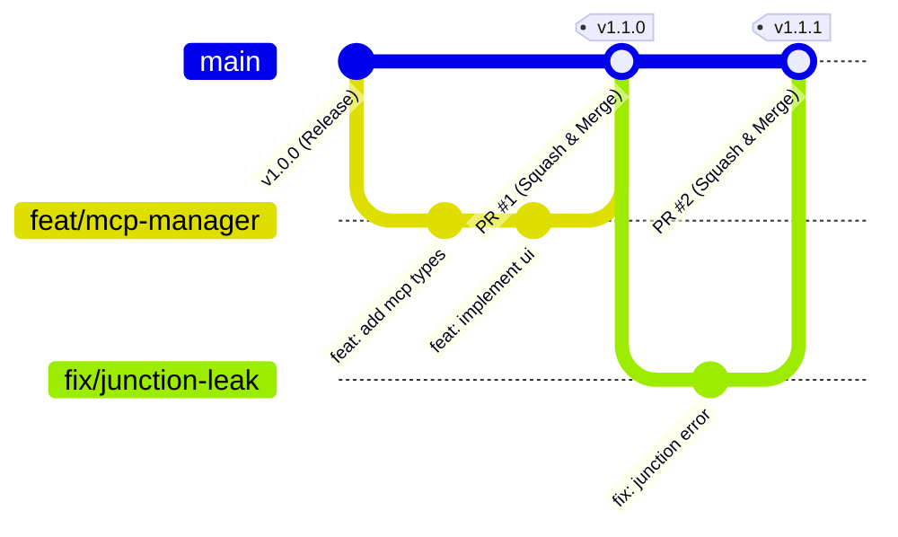

# AgentHub 协作与仓库管理规范 (CONTRIBUTING.md)

感谢你对 **AgentHub (AGENT_CONFIG_MANAGE)** 项目的关注与贡献！为了保障项目的稳定性、代码质量与协作效率，所有贡献者与维护者请严格遵循以下规范。

---

## 📌 目录

1. [分支管理模型与保护策略](#1-分支管理模型与保护策略)
2. [日常标准开发工作流](#2-日常标准开发工作流)
3. [Commit 提交信息规范 (Conventional Commits)](#3-commit-提交信息规范-conventional-commits)
4. [Pull Request (PR) 流程与评审标准](#4-pull-request-pr-流程与评审标准)
5. [本地代码与架构规范](#5-本地代码与架构规范)
6. [版本发布与 Release 策略](#6-版本发布与-release-策略)

---

## 1. 分支管理模型与保护策略

本项目采用 **GitHub Flow** 标准分支模型：



### 1.1 分支分类

- **`main`（主干受保护分支）**：
  - 唯一生产就绪分支，始终保持可编译、可打包、测试通过状态；
  - **受保护规则**：禁止任何人直接 `git push origin main`，禁止 Force Push，禁止删除；
  - **唯一准入机制**：必须通过 Pull Request 并经过自动化 CI 验证和至少 1 位 Reviewer 批准后方可合并。
- **`feat/<feature-name>`（功能分支）**：
  - 用于开发新功能或适配新 Agent，如 `feat/mcp-server-bus`、`feat/skills-market`；
  - 从最新 `main` 签出，合并后自动删除。
- **`fix/<bug-name>`（缺陷修复分支）**：
  - 用于修复 Bug 或安全隐患，如 `fix/junction-permission`、`fix/hardlink-sync`。
- **`docs/<doc-name>`（文档维护分支）**：
  - 用于更新 README、HANDOVER 或使用指南，如 `docs/update-agent-matrix`。
- **`refactor/<name>`（重构与性能优化分支）**：
  - 用于架构重构或样式调优。

---

## 2. 日常标准开发工作流

### 步骤 1：同步主干并拉取特性分支
```bash
git checkout main
git pull origin main
git checkout -b feat/your-feature-name
```

### 步骤 2：本地开发与自测验证
在准备提交前，必须在本地运行以下两条指令确保 100% 零错误：
```bash
# 1. TypeScript 静态类型检查
npx tsc --noEmit

# 2. 生产环境构建验证
npm run build
```

### 步骤 3：提交更改并推送到远端
```bash
git add .
git commit -m "feat(module): add descriptive commit message"
git push -u origin feat/your-feature-name
```

### 步骤 4：在 GitHub 提交 Pull Request
1. 在 GitHub 仓库页面点击 **Compare & pull request**；
2. 按照 [PR 模板](.github/PULL_REQUEST_TEMPLATE.md) 填写变更说明与测试结果；
3. 等待 GitHub Actions CI 自动化流水线绿灯通过；
4. 请求维护者进行 Code Review。

### 步骤 5：Squash and Merge 合并入主干
- 评审通过后，仓库管理员采用 **Squash and Merge** 方式合并，保持 `main` 分支拥有干净线性、单次发布单条纪律的提交历史；
- 合并完成后勾选 **Delete branch** 清理远端特性分支。

---

## 3. Commit 提交信息规范 (Conventional Commits)

所有提交信息推荐遵循 **Conventional Commits 1.0.0** 规范：

```text
<type>(<scope>): <subject>
```

### 3.1 常用 Type 说明

| Type | 说明 | 示例 |
|---|---|---|
| `feat` | 新增功能或支持新 Agent | `feat(agents): add deepseek harness native adapter` |
| `fix` | 修复缺陷或逻辑 Bug | `fix(storage): resolve ignored_skills overwrite issue` |
| `docs` | 仅文档改动 | `docs: update 16 agents master matrix in README` |
| `style` | 不影响代码运行逻辑的格式、样式微调 | `style(ui): refine light mode badge contrast` |
| `refactor` | 代码重构（既不新增功能也不修 Bug） | `refactor(api): simplify localApi routing logic` |
| `perf` | 提升性能的代码变更 | `perf(matrix): optimize agent pill picker teleport rendering` |
| `test` | 增加或修正单元测试/集成测试 | `test(git_guard): add hook backup rollback test` |
| `chore` | 构建流程、依赖更新或配置辅助工具变动 | `chore: update tailwind and simple-icons dependencies` |
| `ci` | CI/CD 流水线配置文件改动 | `ci: add PR typecheck verification workflow` |

---

## 4. Pull Request (PR) 流程与评审标准

### 4.1 合并准入硬性条件 (Definition of Done)
- [ ] **CI 流水线全绿**：GitHub Actions 的 `Frontend Typecheck & Build` 必须全部通过；
- [ ] **无控制台报错**：运行 `npm run dev` 打开浏览器开发者工具，无运行时 JavaScript/TypeScript 报错；
- [ ] **Dual-Mode 双端对齐**：若涉及底层文件系统（NTFS Junction/Hardlink）或数据存储改动，**必须确保 Rust 端 (`src-tauri/src/`) 与 Node Web 端 (`src/server/localApi.ts`) 双向实现逻辑 100% 对齐**；
- [ ] **Single Source of Truth 同步**：如新增了 Agent 适配或修改了 JSON Schema，必须同步更新 [HANDOVER.md](HANDOVER.md) 与 [README.md](../README.md)。

---

## 5. 本地代码与架构规范

1. **零外部 Git 冲突原则**：
   - 严禁直接在用户项目根目录无通知修改追踪中的公共 `AGENTS.md`；
   - 本地规则必须精准分发至对应 Agent 专属私有文件（`CLAUDE.local.md`, `ZCODE.local.md` 等），并自动写入 `.git/info/exclude`；
2. **链接操作走统一决策矩阵（跨平台）**：
   - 任何技能/目录的软链、硬链、复制分发，必须经「Agent × 平台 → 链接策略矩阵」决策（Rust `src-tauri/src/fs_junction.rs::link_strategy_for` / Node `src/shared/linkStrategy.ts`），禁止在业务代码里散落 `mklink` / `symlink` / `hard_link` 调用；
   - 默认策略：Windows 用 NTFS Junction、macOS/Linux 用 symlink；Antigravity 特殊沙箱三平台统一采用 **Hardlink Tree（物理目录 + 文件硬链接）**；回退链 hardlink-tree → copy。
3. **前端 UI/UX 原则**：
   - 遵循 Tailwind `dark:` 原生双模变量，浅色模式必须保持高对比度与清爽质感，杜绝使用破坏层级的 `!important` 强制反色；
   - 所有全局浮动下拉框（如 `AgentPillPicker`）必须使用 `<Teleport to="body">` 结合视口翻转，避免被父级卡片截断。

### 跨平台开发规范（WI-011 后强制，与根 `AGENTS.md` 同一份）

1. **三平台一致**：所有新功能在 Windows / macOS / Linux 三平台行为一致，禁止只验证单一平台。
2. **Dual-Mode 双端对齐**：涉及底层文件系统 / 配置 / Git 的改动，Rust Tauri 端（`src-tauri/src/`）与 Node Web 端（`src/server/localApi.ts`）实现 100% 对齐。
3. **链接操作走统一决策矩阵**：见上方第 2 条；禁止在业务代码里散落 `mklink` / `symlink` / `hard_link` 调用。
4. **平台差异走统一抽象**：路径（npm 全局目录 / Agent 目录 / 数据目录）、代理、进程树清理、系统主题检测等，收敛到统一 helper，禁止硬编码 `AppData\Roaming`、`taskkill`、WinINET。
5. **新代码三平台验证**：提交前至少在目标平台（或 CI）跑通；不得以「本机是 Windows」为由跳过 macOS / Linux 验证。

---

## 6. 版本发布与 Release 策略

本项目遵循 **Semantic Versioning (SemVer 2.0.0)** 规范：`vMAJOR.MINOR.PATCH`

- **MAJOR（主版本号）**：底层架构重大重构或不向下兼容的存储 Schema 变更；
- **MINOR（次版本号）**：新增主流 Agent 深度适配、新增核心功能系统（如 MCP 总线）；
- **PATCH（修订号）**：Bug 修复、样式体验优化与文档补充。

### 打 Tag 与发布步骤：
```bash
git checkout main
git pull origin main

# 创建带签名的轻量/附注 Tag
git tag -a v1.0.1 -m "Release v1.0.1: Multi-Agent sync and stability improvements"

# 推送 Tag 触发 Release
git push origin v1.0.1
```
随后前往 GitHub Releases 页面关联该 Tag 并发布更新说明。
